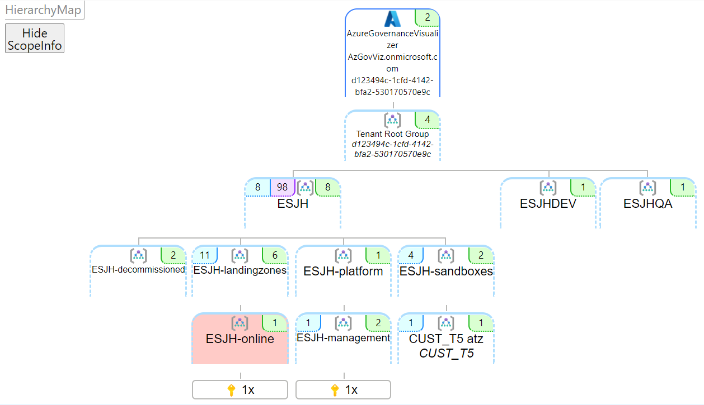
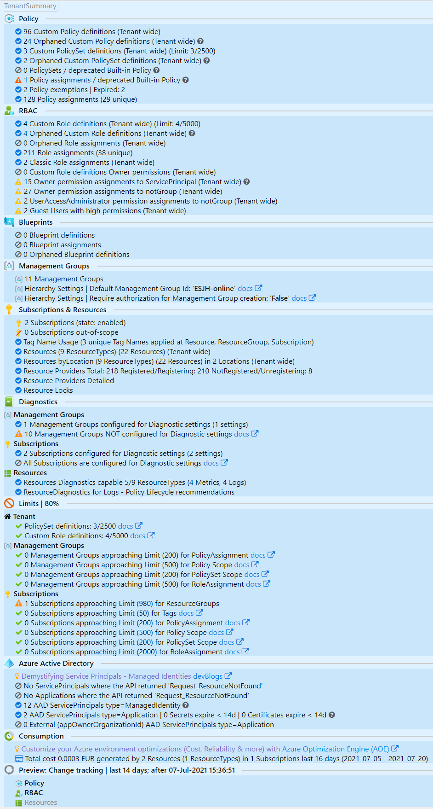

# AzGovViz - Azure Governance Visualizer

Do you want to get granular insights on your technical Azure Governance implementation? - document it in csv, html and markdown?  
AzGovViz is a PowerShell based script that iterates your Azure Tenant´s Management Group hierarchy down to Subscription level. It captures most relevant Azure governance capabilities such as Azure Policy, RBAC and Blueprints and a lot more. From the collected data AzGovViz provides visibility on your __HierarchyMap__, creates a __TenantSummary__ and builds granular __ScopeInsights__ on Management Groups and Subscriptions. The technical requirements as well as the required permissions are minimal.

You can run the script either for your Tenant Root Group or any other Management Group that you have read access on.

<table>
<td>

"_Azure Governance can be a complex thing_.."

Challenges:

 * Holistic overview on governance implementation  
 * Connecting the dots

AzGovViz is intended to help you to get a holistic overview on your technical Azure Governance implementation by connecting the dots.

</td>
<td>

</td>
</table>

## AzGovViz @ Microsoft Cloud Adoption Framework

<table>
<td>

</td>
<td>

Listed as tool for the Govern discipline in the Microsoft Cloud Adoption Framework!  
https://docs.microsoft.com/en-us/azure/cloud-adoption-framework/reference/tools-templates#govern

Included in the Microsoft Cloud Adoption Framework´s [Strategy-Plan-Ready-Gov](https://azuredevopsdemogenerator.azurewebsites.net/?name=strategyplan) Azure DevOps Demo Generator template. 

</td>
</table>

## AzGovViz version history

### AzGovViz version 4
Updates 2020-Nov-01
* Error handling optimization
* Enhanced read-permission validation
* Toggle capabilities in __TenantSummary__ (avoiding information overload)

Updates 2020-Oct-12
* Adding option to download html tables to csv  

* preloading of <a href="https://www.tablefilter.com/" target="_blank">TableFilter</a> removed for __ScopeInsights__ (on poor hardware loading the html file took quite long)
* Added column un-select option for some html tables
* Performance optimization

Release v4
* Resource information for Management Groups (Resources in all child Subscriptions) in the __ScopeInsights__ section
* Excluded Subscriptions information (whitelisted, disabled, AAD_ QuotaId)
* Bugfixes, Bugfixes, Bugfixes
* Cosmetics and User Experience enhancement
* Performance optimization
* API error handling / retry optimization
* New Parameters `-NoASCSecureScore`, `-NoResourceProvidersDetailed` (see [__Parameters__](#powerShell))

### AzGovViz version 3

* HTML filterable tables
* Resource Types Diagnostics capability check
* ResourceDiagnostics Policy Lifecycle recommendations (experimental)
* Resource Diagnostics Policy Findings
* Resource Provider details
* Policy Assignments filter excluded scopes
* Use of deprecated built-in policies
* Subscription QuotaId Whitelist

### AzGovViz version 2

* Optimized user experience for the HTML output
* __TenantSummary__ / selected Management Group scope
* Reflect Tenant, ManagementGroup and Subscription Limits for Azure Governance capabilities
* Some security related best practice highlighting
* More details: Management Groups, Subscriptions, Policies, Policy Sets (Initiatives), Orphaned Policies, RBAC and Policy related RBAC (DINE MI), Orphaned Roles, Orphaned RoleAssignments, Blueprints, Subscription State, Subscription QuotaId, Subscription Tags, Azure Scurity Center Secure Score, ResourceGroups count, Resource types and count by region, Limits, Security findings
* Resources / leveraging Azure Resource Graph
* Parameter based output (hierarchy only, 'srubbed' user information and more..)
* HTML version check

## AzGovViz in Action

### Demo

<a href="https://www.azadvertizer.net/azgovvizv4/demo/AzGovViz_EnterpriseScale_Demo.html" target="_blank">AzGovViz Demo</a> EnterpriseScale implementation

### Screenshots

html file

__HierarchyMap__  
  
__TenantSummary__
  
__ScopeInsights__
  
*_IDs from screenshot are randomized_

markdown in Azure DevOps Wiki as Code

 
*_IDs from screenshot are randomized_

### Outputs

* CSV file
* HTML file
  * the html file uses Java Script and CSS files which are hosted on various CDNs (Content Delivery Network). For details review the BuildHTML region in the AzGovViz.ps1 script file.
  * Browsers tested: Edge, new Edge and Chrome
* MD (markdown) file
  * for use with Azure DevOps Wiki leveraging the [Mermaid](https://docs.microsoft.com/en-us/azure/devops/release-notes/2019/sprint-158-update#mermaid-diagram-support-in-wiki) plugin

> Note: there is some fixing ongoing at the mermaid project to optimize the graphical experience:  
 <https://github.com/mermaid-js/mermaid/issues/1177>

## AzGovViz slideset

Short presentation on AzGovViz [Download](slides/AzGovViz_intro.pdf)

## AzGovViz technical documentation

### Required permissions in Azure

* RBAC permissions: __Reader__ role on Management Group level
* API permissions: If you run the script in the context of a Service Principal or in Azure Automation or on a Azure DevOps hosted agent (on top of the RBAC Role: _Reader_ on Management Group level) you will need to grant API permissions in Azure Active Directory (get-AzRoleAssignment cmdlet requirements). The Automation Account or Service Connection __App registration (Application)__ must be granted with: __Azure Active Directory API | Application | Directory | Read.All__ (admin consent required)

### Usage

#### PowerShell

* Requires PowerShell Az Modules
  * Az.Accounts
  * Az.Resources
  * Az.ResourceGraph
* Usage
  * `.\AzGovViz.ps1 -ManagementGroupId <your-Management-Group-Id>`
* Parameters
  * `-ManagementGroupId` Tenant Id or any child Management Group Id
  * `-CsvDelimiter` the world is split into two kind of delimiters - comma and semicolon - choose yours
  * `-OutputPath`
  * `-AzureDevOpsWikiAsCode`
  * `-DoNotShowRoleAssignmentsUserData` scrub user information
  * `-LimitCriticalPercentage` limit warning level, default is 80%
  * ~~`-HierarchyTreeOnly`~~ `-HierarchyMapOnly` output only the __HierarchyMap__ for Management Groups including linked Subscriptions
  * `-SubscriptionQuotaIdWhitelist` process only subscriptions with defined QuotaId(s)
  * `-NoResourceProvidersDetailed` disables output for ResourceProvider states for all Subscriptions in the __TenantSummary__ section, in large Tenants this can become time consuming
  * `-NoASCSecureScore` disables ASC Secure Score request for Subscriptions. The used API is in preview you may want to disable this
  * ~~`-UseAzureRM`~~ support for AzureRm modules has been deprecated
* Passed tests: Powershell Core on Windows
* Passed tests: Powershell 5.1.18362.752 on Windows
* Passed tests: Powershell Core on Linux Ubuntu 18.04 LTS

#### Azure DevOps Pipeline

The provided example Pipeline is configured to run based on a [schedule](https://docs.microsoft.com/en-us/azure/devops/pipelines/process/scheduled-triggers) (every 12 hours). It will push the AzGovViz markdown output file to the 'wiki' folder in the 'Azure-MG-Sub-Governance-Reporting' Repository which will feed your Wiki.

1. In Azure DevOps make sure to [enable](https://docs.microsoft.com/en-us/azure/devops/project/navigation/preview-features?view=azure-devops&tabs=new-account-enabled) the Multistage Pipelines feature <https://docs.microsoft.com/en-us/azure/devops/pipelines/get-started/multi-stage-pipelines-experience?view=azure-devops>
2. Clone the AzGovViz Repo
3. Create Pipeline, configure your pipeline selecting __Existing Azure Pipelines YAML file__, select the AzGovViz YAML from the AzGovViz (Azure-MG-Sub-Governance-Reporting) Repo
4. Grant Repository permissions: In order to allow the pipeline to push files back to our 'wiki' folder in the 'Azure-MG-Sub-Governance-Reporting' Repository the __Build Service__ Account ('%ProjectName% Build Service (%OrgName%)') must be granted with __Contribute__ permission  

5. Run the Pipeline
6. Create Wiki by choosing [Publish Code as Wiki](https://docs.microsoft.com/en-us/azure/devops/project/wiki/publish-repo-to-wiki?view=azure-devops&tabs=browser), define the folder 'wiki' from the 'Azure-MG-Sub-Governance-Reporting' Repository as source

> Make sure your Service Connection has the required permissions (see [__Required permissions in Azure__](#required-permissions-in-azure)).

## AzGovViz sidenotes

### Security

AzGovViz creates very detailed information about your Azure Governance setup. In your organizations best interest the __outputs should be protected from not authorized access!__

### Facts

Disabled Subscriptions and Subscriptions where Quota Id starts with with "AAD_" are being skipped (check parameter `-SubscriptionQuotaIdWhitelist`), all others are queried. More info on Quota Id / Offer numbers: <a href="https://docs.microsoft.com/en-us/azure/cost-management-billing/costs/understand-cost-mgt-data#supported-microsoft-azure-offers" target="_blank">Supported Microsoft Azure offers</a> 
.  

ARM Limits are not acquired programmatically, they are hardcoded. The links used to check related Limits are commented in the param section of the script.

### Contributions

Please feel free to contribute. Thanks to so many supporters - testing, giving feedback, making suggestions, presenting use-case, posting/blogging articles, refactoring code - THANK YOU!

Thanks Stefan Stranger for providing me with his AzGovViz outputs executed on his implementation of EnterpriseScale. Make sure you read Stefan´s Blog Article: <a href="https://stefanstranger.github.io/2020/08/28/EnterpriseScalePolicyDrivenGovernance/" target="_blank">Enterprise-Scale - Policy Driven Governance</a> 

Special thanks to Tim Wanierke, Brooks Vaughn and Friedrich Weinmann (Microsoft).

Kudos to the <a href="https://www.tablefilter.com/" target="_blank">TableFilter</a> Project Team!

## AzAdvertizer

Also check <https://www.azadvertizer.net> to keep up with the pace on Azure Governance capabilities such as Azure Policies, Policy Initiatives, Policy Aliases, RBAC Roles and Resource Providers including operations.
