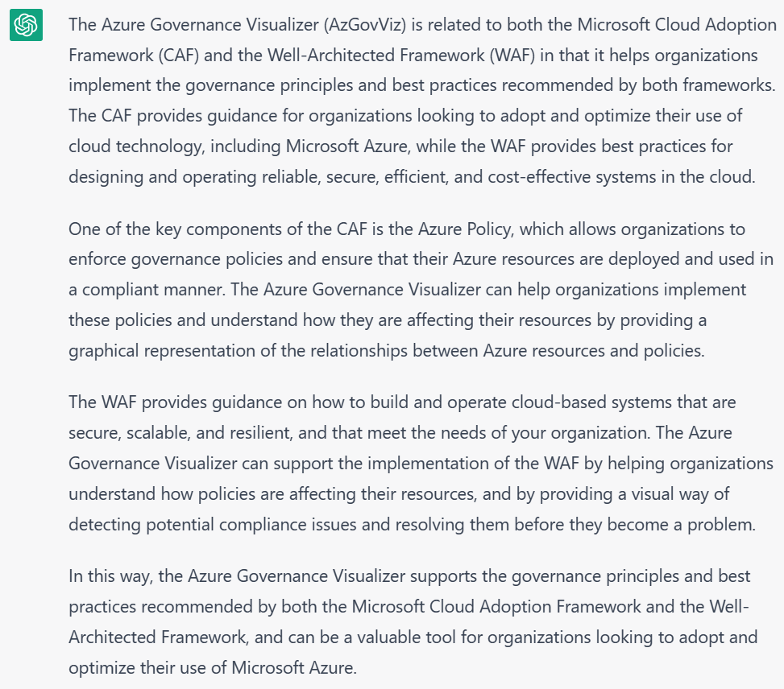
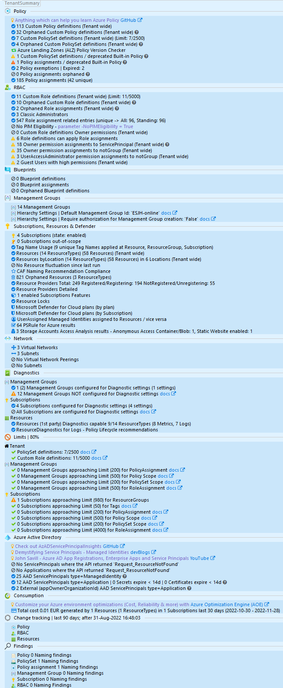
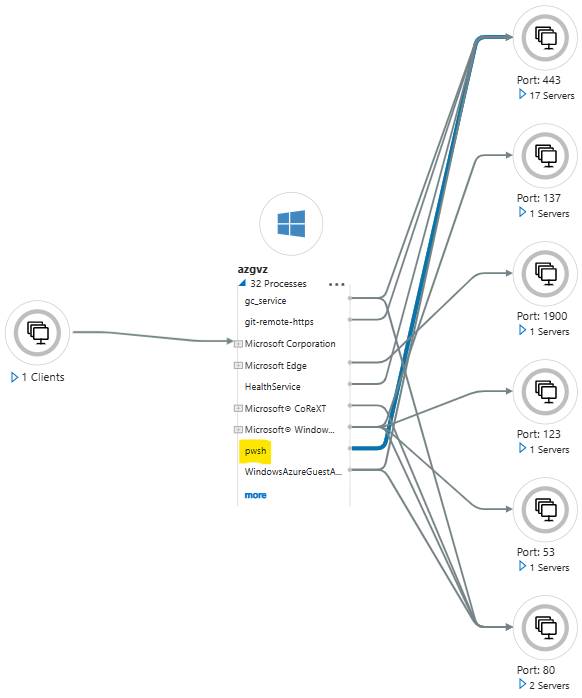
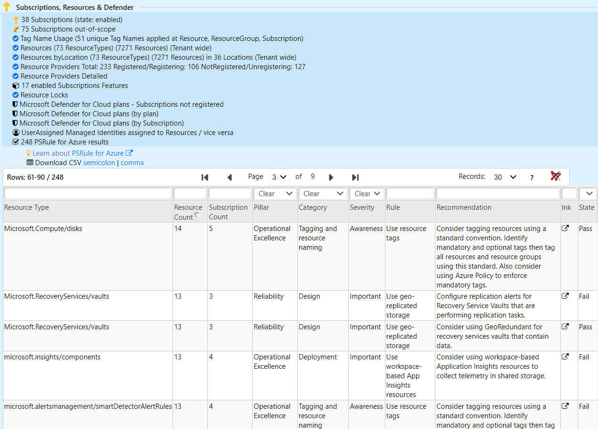
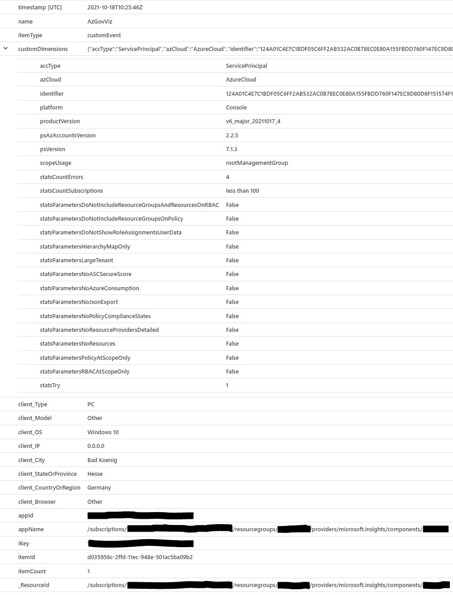
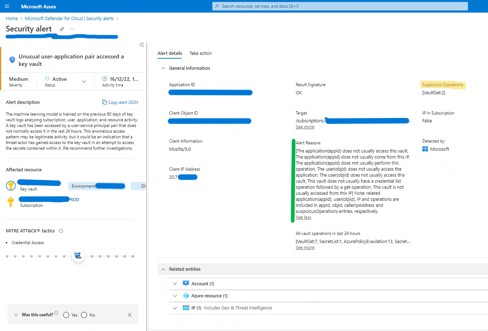

# Azure Governance Visualizer aka AzGovViz

Do you want to get granular insights on your technical Azure Governance implementation? - document it in CSV, HTML, Markdown and JSON?
Azure Governance Visualizer is a PowerShell based script that iterates your Azure Tenant´s Management Group hierarchy down to Subscription level. It captures most relevant Azure governance capabilities such as Azure Policy, RBAC and Blueprints and a lot more. From the collected data Azure Governance Visualizer provides visibility on your __HierarchyMap__, creates a __TenantSummary__, creates __DefinitionInsights__ and builds granular __ScopeInsights__ on Management Groups and Subscriptions. The technical requirements as well as the required permissions are minimal.

You can run the script either for your Tenant Root Group or any other Management Group.

## Mission

"_Governance can be a complex thing_.."

Challenges:

* Holistic overview on governance implementation
* Connecting the dots

Azure Governance Visualizer is intended to help you to get a holistic overview on your technical Azure Governance implementation by __connecting the dots__


## Azure Governance Visualizer @ Microsoft CAF & WAF

### Microsoft Cloud Adoption Framework (CAF)

Listed as [tool](https://docs.microsoft.com/en-us/azure/cloud-adoption-framework/reference/tools-templates#govern) for the Govern discipline in the Microsoft Cloud Adoption Framework

Included in the Microsoft Cloud Adoption Framework´s [Strategy-Plan-Ready-Gov](https://azuredevopsdemogenerator.azurewebsites.net/?name=strategyplan) Azure DevOps Demo Generator template

### Microsoft Well Architected Framework (WAF)

Listed as [security monitoring tool](https://docs.microsoft.com/en-us/azure/architecture/framework/security/monitor-tools) in the Microsoft Well Architected Framework

### ChatGPT



## Content

- [Azure Governance Visualizer aka AzGovViz](#azure-governance-visualizer-aka-azgovviz)
  * [Mission](#mission)
  * [Azure Governance Visualizer @ Microsoft CAF \& WAF](#azure-governance-visualizer--microsoft-caf--waf)
    * [Microsoft Cloud Adoption Framework (CAF)](#microsoft-cloud-adoption-framework-caf)
    * [Microsoft Well Architected Framework (WAF)](#microsoft-well-architected-framework-waf)
    * [ChatGPT](#chatgpt)
  * [Content](#content)
  * [Release history](#release-history)
  * [Demo](#demo)
    * [Media](#media)
    * [Slideset](#slideset)
  * [Features](#features)
  * [Screenshots](#screenshots)
  * [Outputs](#outputs)
  * [Trust](#trust)
  * [Azure Governance Visualizer Setup Guide](#azure-governance-visualizer-setup-guide)
  * [Technical documentation](#technical-documentation)
    * [Permissions overview](#permissions-overview)
    * [Required permissions in Azure](#required-permissions-in-azure)
    * [Required permissions in Azure Active Directory](#required-permissions-in-azure-active-directory)
    * [PowerShell](#powershell)
    * [Parameters](#parameters)
    * [API reference](#api-reference)
  * [Integrate with AzOps](#integrate-with-azops)
  * [Integrate PSRule for Azure](#integrate-psrule-for-azure)
  * [Stats](#stats)
    * [How/What?](#howwhat)
  * [Security](#security)
  * [Known issues](#known-issues)
  * [Facts](#facts)
  * [Contribution](#contribution)
  * [AzAdvertizer](#azadvertizer)
  * [AzADServicePrincipalInsights](#azadserviceprincipalinsights)
  * [Closing Note](#closing-note)

## Release history

__Changes__ (2023-Jun-16 / 6.2.1 Minor)

* fix feature diagnostic capable resource name containing "+"

Passed tests: Powershell Core 7.3.3 on Windows
Passed tests: Powershell Core 7.2.10 Azure DevOps hosted agent ubuntu-22.04
Passed tests: Powershell Core 7.2.10 Github Actions hosted agent ubuntu-latest
Passed tests: Powershell Core 7.2.10 GitHub Codespaces mcr.microsoft.com/powershell:latest
Passed tests: AzureCloud, AzureUSGovernment, AzureChinaCloud

[Full release history](history.md)

## Demo

<a href="https://www.azadvertizer.net/azgovvizv4/demo/AzGovViz_demo.html" target="_blank"></a>

[Demo (v6_major_20220927_1)](https://www.azadvertizer.net/azgovvizv4/demo/AzGovViz_demo.html)

More [demo output](https://github.com/JulianHayward/AzGovViz)

### Media

* Microsoft Tech Talks - Bevan Sinclair (Cloud Solution Architect Microsoft) [Automated Governance Reporting in Azure (MTT0AEDT)](https://mtt.eventbuilder.com/event/66431) (register to view)
* Microsoft Dev Radio (YouTube) [Get visibility into your environment with Azure Governance Visualizer](https://www.youtube.com/watch?v=hZXvF5oypLE)
* Jack Tracey (Cloud Solution Architect Microsoft) [Azure Governance Visualizer With Azure DevOps](https://jacktracey.co.uk/azgovviz-with-azure-devops/)

### Slideset

Short presentation on Azure Governance Visualizer [[download](slides/AzGovViz_intro.pdf)]

## Features

* __Hierarchy of Management Groups__
  * Builds a visual hierarchy of your Management Group setup including counts on linked Subscriptions, Policy assignments, scoped Policy/Set definitions and Role assignments per Management Group
* __Azure Policy__
  * Custom Policy definitions
    * Scope information
    * Policy effect
    * If Policy effect is DeployIfNotExists (DINE) will show the specified RBAC Role
    * List of assignments
    * Usage in custom PolicySet definitions
    * System metadata 'createdOn, createdBy, updatedOn, updatedBy' ('createdBy', 'updatedBy' identity is fully resolved)
  * Orphaned custom Policy definitions
    * List of custom Policy definitions that matches the following criteria:
      * Policy definition is not used in any custom PolicySet definition
      * No Policy assignment exists for the Policy definition
  * Custom PolicySet definitions
    * Scope information
    * List unique assignments
    * List of Policy definitions used
  * Orphaned custom PolicySet definitions
    * Criteria: no Policy assignment exists for the PolicySet definition
  * Custom PolicySet definitions using deprecated built-in Policy definitions
  * Policy assignments of deprecated built-in Policy definition
  * Policy Exemptions
    * Lists all Exemptions (scopes: Management Groups, Subscriptions, ResourceGroups, Resources)
    * Enrich information on Exemption scope
    * Summary on expired Exemptions
  * Policy assignments orphaned
    * Policy assignments's Policy definition does not exist / likely Management Group scoped Policy defintion - Management Group deleted
  * Policy assignments throughout the entirety of scopes (Management Groups, Subscriptions and Resource Groups)
    * Core information on Policy assignments
      * NonCompliance Message on Policy assignment for a PolicySet will only show the default non-compliance message
    * Advanced/enriched information on Policy assignments
      * Policy assignment scope (at scope/inheritance)
      * Indicates if scope is excluded from Policy assignment
      * Indicates if Exemption applies for scope
      * Policy/Resource Compliance (Policy: NonCompliant, Compliant; Resource: NonCompliant, Compliant, Conflicting)
      * Related RBAC Role assignments (if Policy effect is DeployIfNotExists (DINE) or Modify)
      * Resolved Managed Identity (if Policy effect is DeployIfNotExists (DINE) or Modify)
      * System metadata 'createdOn, createdBy, updatedOn, updatedBy' ('createdBy', 'updatedBy' identity is fully resolved)
      * Parameters used
  * ALZ Policy Version Checker - Azure Landing Zones Policy Version Checker for Policy and Set definitions. Azure Governance Visualizer will clone the ALZ GitHub repository and collect the ALZ policy and set definitions history. The ALZ data will be compared with the data from your tenant so that you can get lifecycle management recommendations for ALZ policy and set definitions that already exist in your tenant plus a list of ALZ policy and set definitions that do not exist in your tenant. The ALZ Policy Version Checker results will be displayed in the __TenantSummary__ and a CSV export `*_ALZPolicyVersionChecker.csv` will be provided.
  * Policy Remediaton - list all remediatable policies including relevant information such as assignment and definition data
* __Role-Based Access Control (RBAC)__
  * Custom Role definitions
    * List assignable scopes
    * System metadata 'createdOn, createdBy, updatedOn, updatedBy' ('createdBy', 'updatedBy' identity is fully resolved)
  * Orphaned custom Role definitions
    * List of custom Role definitions that matches the following criteria:
      * Role definition is not used in any Role assignment
      * Role is not used in a Policy definition´s rule (roleDefinitionIds)
  * Orphaned Role assignments
    * List of Role assignments that matches the following criteria:
      * Role definition was deleted although and assignment existed
      * Role assignmet's target identity (User, Group, ServicePrincipal) was deleted
  * Role assignments throughout the entirety of scopes (Management Groups, Subscriptions, Resource Groups and Resources)
    * Core information on Role assignments
    * Advanced information on Role assignments
      * Role assignment scope (at scope / inheritance)
      * For Role Assignments on Groups the AAD Group members are fully resolved. With this capability Azure Governance Visualizer can ultimately provide holistic insights on permissions granted
      * For Role Assignments on Groups the AAD Group members count (transitive) will be reported
      * For identity-type == 'ServicePrincipal' the type (Application (internal/external) / ManagedIdentity (System assigned/User assigned)) will be revealed
      * For identity-type == 'User' the userType (Member/Guest) will be revealed
      * Related Policy assignments (Policy assignment that leverages the DeployIfNotExists (DINE) or Modify effect)
      * System metadata 'createdOn, createdBy' ('createdBy' identity is fully resolved)
      * Determine if the Role assignment is 'standing' or PIM (Privileged Identity Management) managed
      * Determine if the Role assignmet's Role definition is capable to write Role assignments
  * PIM (Privileged Identity Management) eligibility for Role assignments
    * Get a full report of all PIM eligible Role assignments for Management Groups and Subscriptions, including resolved User members of AAD Groups that have assigned eligibility
    * &#x1F4A1; Note: this feature requires you to execute as Service Principal with `Application` API permission `PrivilegedAccess.Read.AzureResources`
  * Role assignments ClassicAdministrators
  * Security & Best practice analysis
    * Existence of custom Role definition that reflect 'Owner' permissions
    * Report all Role definitions that are capable to write Role assignments, list all Role assignments for those Role definitions
    * Role assignments for 'Owner' permissions on identity-type == 'ServicePrincipal'
    * Role assignments for 'Owner' permissions on identity-type != 'Group'
    * Role assignments for 'User Access Administrator' permissions on identity-type != 'Group'
    * High priviledge Role assignments for 'Guest Users' (Owner & User Access Administrator)
* __Blueprints__
  * Blueprint scopes and assignments
  * Orphaned Blueprints
* __Management Groups__
  * Management Group count, level/depth, MG children, Sub children
  * Hierarchy Settings | Default Management Group Id
  * Hierarchy Settings | Require authorization for Management Group creation
* __Subscriptions, Resources & Defender__
  * Subscription insights
    * State
    * QuotaId
    * Role assignment limit
    * Tags
    * Owner & User Access Administrator Role assignment count (at scope) direct and indirect plus PIM eligibility count
    * Microsoft Defender for Cloud Secure Score
    * Microsoft Defender for Cloud Email notifications configuration
    * Cost
    * Management Group path
  * Tag Name usage
    * Insights on usage of Tag Names on Subscriptions, ResourceGroups and Resources
  * Resources
    * Resource Types
      * ResourceType count per location
      * Resource Provider
        * Resource Provider state aggregation throughout all Subscriptions
        * Explicit Resource Provider state per Subscription
      * Resource Locks
        * Aggregated insights for Lock and respective Lock-type usage on Subscriptions, ResourceGroups and Resources
        * CSV output detailed / each scope that has a lock applied (at scope)
    * Resource fluctuation - added/removed resources since previous Azure Governance Visualizer execution
      * Aggregated insights on resource fluctuation add/remove (HTML)
      * Detailed insights on resource fluctuation add/remove (CSV)
    * Cost optimization & cleanup (ARG)
      * If you run Azure Governance Visualizer with parameter -DoAzureConsumption then the orphaned/unused resources output will show you potential cost savings for orphaned/unused resources with intent 'cost savings'
      * The Cost optimization & cleanup feature is based on [Azure Orphan Resources - GitHub](https://github.com/dolevshor/azure-orphan-resources) ARG queries and workbooks by Dolev Shor
      * The virtual machines that are stopped but not deallocated are still generating compute costs. You should check if there are virtual machines running within your environment that are only stopped. The output will show these virtual machines with intent 'cost savings - stopped but not deallocated VM'.
    * Cloud Adoption Framework (CAF) [Recommended abbreviations for Azure resource types](https://docs.microsoft.com/en-us/azure/cloud-adoption-framework/ready/azure-best-practices/resource-abbreviations) compliance
  * Microsoft Defender for Cloud
    * Summary of Microsoft Defender for Cloud coverage by plan (count of Subscription per plan/tier)
    * Summary of Microsoft Defender for Cloud plans coverage by Subscription (plan/tier)
    * Highlight the usage of deprecated Defender plans (e.g. Container Registry & Kubernetes)
  * UserAssigned Managed Identities assigned to Resources / vice versa
    * Summary of all UserAssigned Managed Identities assigned to Resources
    * Summary of Resources that have an UserAssigned Managed Identity assigned
  * [Integrate PSRule for Azure](#integrate-psrule-for-azure)
    * __Pausing 'PSRule for Azure' integration__. Azure Governance Visualizer leveraged the Invoke-PSRule cmdlet, but there are certain [resource types](https://github.com/Azure/PSRule.Rules.Azure/blob/ab0910359c1b9826d8134041d5ca997f6195fc58/src/PSRule.Rules.Azure/PSRule.Rules.Azure.psm1#L1582) where also child resources need to be queried to achieve full rule evaluation.
    * Well-Architected Framework aligned best practice analysis for resources, including guidance for remediation
  * Storage Account Access Analysis
    * Provides insights on Storage Accounts with focus on anonymous access (containers/blobs and 'Static website' feature)
* __Network__
  * Virtual Networks
  * Subnets
  * Virtual Network Peerings
  * Private Endpoints
* __Diagnostics__
  * Management Groups Diagnostic settings report
    * Management Group, Diagnostic setting name, target type (LA, SA, EH), target Id, Log Category status
  * Subscriptions Diagnostic settings report
    * Subscription, Diagnostic setting name, target type (LA, SA, EH), target Id, Log Category status
  * Resources Diagnostic capabilty report (1st party Resource types only)
    * ResourceType capability for Resource Diagnostics including
      * ResourceType count and information if capable for logs including list of available og categories
      * ResourceType count and information if capable for metrics
  * Lifecyle recommendations for existing Azure Policy definitions that configure Resource diagnostics of type=Log
    * Check if Policy definitions hold the latest set of applicable log categories
    * Recommendation to create Policy definition for ResourceType if supported
    * Lists all PolicyDefinitions that deploy Resource diagnostics of type=log, lists Policy assignments and PolicySet assignments if the Policy defintion is used in a PolicySet definition
* __Limits__
  * Tenant approaching ARM limits:
    * Custom Role definitions
    * PolicySet definitions
  * Management Groups approaching ARM limits:
    * Policy assignment limit
    * Policy / PolicySet definition scope limit
    * Role assignment limit
  * Subscriptions approaching ARM limits:
    * ResourceGroup limit
    * Subscription Tags limit
    * Policy assignment limit
    * Policy / PolicySet definition scope limit
    * Role assignment limit
* __Azure Active Directory (AAD)__
  * Insights on those Service Principals where a Role assignment exists (scopes: Management Group, Subscription, ResourceGroup, Resource):
    * Type=ManagedIdentity
      * Core information on the Service Principal such as related Ids, use case information and Role assignments
      * For UserManaged Identities the count of assignment to Resources is reported
      * Orphaned Managed Identity - Policy assignment related Managed Identities / the related Policy assignment does not exist
      * UserAssigned Managed Identity - count of Resources that it is assigned to
    * Type=Application
      * Secrets and Certificates expiry information & warning
      * Report on external Service Principals
* __Consumption__
  * Aggregated consumption insights throughout the entirety of scopes (Management Groups, Subscriptions)
* __Change tracking__
  * Policy
    * Created/Updated Policy and PolicySet definitions (system metadata 'createdOn, createdBy, updatedOn, updatedBy')
    * Created/Updated Policy assignments (system metadata 'createdOn, createdBy, updatedOn, updatedBy')
  * RBAC
    * Created/Updated Role definitions (system metadata 'createdOn, createdBy, updatedOn, updatedBy')
    * Created Role assignments (system metadata 'createdOn, createdBy)
  * Resources
    * Aggregated insights on Created/Changed Resources

## Screenshots

HTML file

__HierarchyMap__

__TenantSummary__

__DefinitionInsights__

__ScopeInsights__

*_IDs from screenshot are randomized_

markdown in Azure DevOps Wiki as Code


*_IDs from screenshot are randomized_
> Note: there is some fixing ongoing at the mermaid project to optimize the graphical experience:
 <https://github.com/mermaid-js/mermaid/issues/1177>

## Outputs

* CSV file
* HTML file
  * the HTML file uses Java Script and CSS files which are hosted on various CDNs (Content Delivery Network). For details review the BuildHTML region in the PowerShell script file.
  * Browsers tested: Edge, new Edge and Chrome
* MD (Markdown) file
  * for use with Azure DevOps Wiki leveraging the [Mermaid](https://docs.microsoft.com/en-us/azure/devops/release-notes/2019/sprint-158-update#mermaid-diagram-support-in-wiki) plugin
* JSON folder ([demo-output](https://github.com/JulianHayward/AzGovViz)) containing
  * all Policy and Role assignments (Scopes: Tenant, Management Groups and Subscriptions)
  * all BuiltIn and Custom Policy/Set definitions (Scopes: Management Groups and Subscriptions)
  * all BuiltIn and Custom Role definitions
  * JSON file of ManagementGroup Hierarchy including all Custom Policy/Set and RBAC definitions, Policy and Role assignments and some more relevant information
  * Tenant tree including all Policy and Role assignments AND all Custom Policy/Set and Role definitions
  

## Trust

_How can we trust a 20k lines PowerShell script?_ Besides assuring that Azure Governance Visualizer will not harm at any intent, you may want to secure yourself. Let´s leverage Azure built-in capabilities such as VM Insights to monitor the Azure Governance Visualizer activity.

Setup a Virtual Machine in Azure, deploy the dependency agent extension and [execute](setup.md#azure-governance-visualizer-from-console) Azure Governance Visualizer.

In the Azure Portal navigate to the Virtual Machine, Click on __Insights__ in the __Monitoring__ section and click on Map. All connections that have been established will be shown. Now let´s focus on the process __pwsh__ and review the established connections.



Query for Log Analytics:

```
VMConnection
| where AgentId =~ '<GUID>'
| where ProcessName =~ 'pwsh'
| summarize by DestinationIp, DestinationPort, RemoteIp, Protocol, Direction, RemoteDnsQuestions, BytesSent, BytesReceived
```

## Azure Governance Visualizer Setup Guide

&#x1F4A1; Although 30 minutes of troubleshooting can save you 5 minutes reading the documentation :) ..
Check the detailed __[Setup Guide](setup.md)__

## Technical documentation

### Permissions overview


### Required permissions in Azure

This permission is <b>mandatory</b> in each and every scenario!

<table>
  <tbody>
    <tr>
      <th>Scenario</th>
      <th>Permissions</th>
    </tr>
    <tr>
      <td><b>ANY</b><br>Console / Azure DevOps / GitHub Actions ..</td>
      <td><b>Reader</b> Role assignment on <b>Management Group</b></td>
    </tr>
  </tbody>
</table>

### Required permissions in Azure Active Directory

<table>
  <tbody>
    <tr>
      <th>Scenario</th>
      <th>Permissions</th>
    </tr>
    <tr>
      <td><b>A</b><br>Console | Member user account</td>
      <td>No AAD permissions required
      </td>
    </tr>
    <tr>
      <td><b>B</b><br>Console | Guest user account</td>
      <td>If the tenant is hardened (AAD External Identities / Guest user access = most restrictive) then Guest User must be assigned the AAD Role 'Directory readers'<br>
      &#x1F4A1; <a href="https://github.com/MicrosoftDocs/azure-docs/blob/master/articles/active-directory/fundamentals/users-default-permissions.md#compare-member-and-guest-default-permissions" target="_blank">Compare member and guest default permissions</a><br>
      &#x1F4A1; <a href="https://docs.microsoft.com/en-us/azure/active-directory/enterprise-users/users-restrict-guest-permissions" target="_blank">Restrict Guest permissions</a>
      </td>
    </tr>
    <tr>
      <td><b>C</b><br>Console | Service Principal | Managed Identity</td>
      <td>
        <table>
          <tbody>
            <tr>
              <th>Capability</th>
              <th>API Permissions</th>
            </tr>
            <tr>
              <td>Get AAD<br>Users</td>
              <td>Service Principal's <b>App registration</b><br>grant with <b>Microsoft Graph</b> permissions:<br>Application permissions / User / User.Read.All<br>&#x1F4A1; <a href="https://docs.microsoft.com/en-us/graph/api/user-get#permissions" target="_blank">Get user</a></td>
            </tr>
            <tr>
              <td>Get AAD<br>Groups</td>
              <td>Service Principal's <b>App registration</b><br>grant with <b>Microsoft Graph</b> permissions:<br>Application permissions / Group / Group.Read.All<br>&#x1F4A1; <a href="https://docs.microsoft.com/en-us/graph/api/group-get#permissions" target="_blank">Get group</a></td>
            </tr>
            <tr>
              <td>Get AAD<br>SP/App</td>
              <td>Service Principal's <b>App registration</b><br>grant with <b>Microsoft Graph</b> permissions:<br>Application permissions / Application / Application.Read.All<br>&#x1F4A1; <a href="https://docs.microsoft.com/en-us/graph/api/serviceprincipal-get#permissions" target="_blank">Get servicePrincipal</a>, <a href="https://docs.microsoft.com/en-us/graph/api/application-get#permissions" target="_blank">Get application</a></td>
            </tr>
            <tr>
              <td>Get PIM Eligibility<br>SP/App</td>
              <td>Service Principal's <b>App registration</b><br>grant with <b>Microsoft Graph</b> permissions:<br>Application permissions / PrivilegedAccess / PrivilegedAccess.Read.AzureResources<br>&#x1F4A1; <a href="https://docs.microsoft.com/en-us/graph/api/resources/privilegedaccess?view=graph-rest-beta" target="_blank">Get privilegedAccess for AzureResources</a><br>If you cannot grant this permission then use parameter <i>-NoPIMEligibility</i></td>
            </tr>
          </tbody>
        </table>
        Optional: AAD Role 'Directory readers' could be used instead of API permissions (more 'read' than required)
      </td>
    </tr>
    <tr>
      <td><b>D</b><br>Azure DevOps / Github Actions | ServicePrincipal</td>
      <td>
        <table>
          <tbody>
            <tr>
              <th>Capability</th>
              <th>API Permissions</th>
            </tr>
            <tr>
              <td>Get AAD<br>Users</td>
              <td>Azure DevOps Service Connection's <b>App registration</b><br>grant with <b>Microsoft Graph</b> permissions:<br>Application permissions / User / User.Read.All<br>&#x1F4A1; <a href="https://docs.microsoft.com/en-us/graph/api/user-get#permissions" target="_blank">Get user</a></td>
            </tr>
            <tr>
              <td>Get AAD<br>Groups</td>
              <td>Azure DevOps Service Connection's <b>App registration</b><br>grant with <b>Microsoft Graph</b> permissions:<br>Application permissions / Group / Group.Read.All<br>&#x1F4A1; <a href="https://docs.microsoft.com/en-us/graph/api/group-get#permissions" target="_blank">Get group</a></td>
            </tr>
            <tr>
              <td>Get AAD<br>SP/App</td>
              <td>Azure DevOps Service Connection's <b>App registration</b><br>grant with <b>Microsoft Graph</b> permissions:<br>Application permissions / Application / Application.Read.All<br>&#x1F4A1; <a href="https://docs.microsoft.com/en-us/graph/api/serviceprincipal-get#permissions" target="_blank">Get servicePrincipal</a>, <a href="https://docs.microsoft.com/en-us/graph/api/application-get#permissions" target="_blank">Get application</a></td>
            </tr>
            <tr>
              <td>Get PIM Eligibility<br>SP/App</td>
              <td>Service Principal's <b>App registration</b><br>grant with <b>Microsoft Graph</b> permissions:<br>Application permissions / PrivilegedAccess / PrivilegedAccess.Read.AzureResources<br>&#x1F4A1; <a href="https://docs.microsoft.com/en-us/graph/api/resources/privilegedaccess?view=graph-rest-beta" target="_blank">Get privilegedAccess for AzureResources</a><br>If you cannot grant this permission then use parameter <i>-NoPIMEligibility</i></td>
            </tr>
          </tbody>
        </table>
        Optional: AAD Role 'Directory readers' could be used instead of API permissions (more 'read' than required)
      </td>
    </tr>
  </tbody>
</table>

Screenshot Azure Portal


### PowerShell

* Requires PowerShell 7 (minimum supported version 7.0.3)
  * [Get PowerShell](https://github.com/PowerShell/PowerShell#get-powershell)
  * [Installing PowerShell on Windows](https://docs.microsoft.com/en-us/powershell/scripting/install/installing-powershell-core-on-windows)
  * [Installing PowerShell on Linux](https://docs.microsoft.com/en-us/powershell/scripting/install/installing-powershell-core-on-linux)
* Requires PowerShell Az Modules
  * Az.Accounts
  * ~~Az.Resources~~
  * ~~Az.ResourceGraph~~
  * [Install the Azure Az PowerShell module](https://docs.microsoft.com/en-us/powershell/azure/install-az-ps)
* Requires PowerShell Module 'AzAPICall'.
Running in Azure DevOps or GitHub Actions the AzAPICall PowerShell module will be installed automatically.
AzAPICall resources:
  * [](https://www.powershellgallery.com/packages/AzAPICall)
  * [GitHub Repository](https://aka.ms/AzAPICall)
* Usage/command
  * `.\AzGovVizParallel.ps1 -ManagementGroupId <your-Management-Group-Id>`

### Parameters

* `-ManagementGroupId` Management Group Id (Root Management Group Id equals your Tenant Id)
* `-CsvDelimiter` - The world is split into two kinds of delimiters - comma and semicolon - choose yours (default is semicolon ';')
* `-OutputPath`
* ~~`-AzureDevOpsWikiAsCode` - Use this parameter only when running AzGovViz in a Azure DevOps Pipeline~~ Based on environment variables the script will detect the code run platform
* `-DoNotShowRoleAssignmentsUserData` - Scrub personally identifiable information (PII)
* `-LimitCriticalPercentage` - Limit warning level, default is 80%
* ~~`-HierarchyTreeOnly`~~ `-HierarchyMapOnly` - Output only the __HierarchyMap__ for Management Groups including linked Subscriptions
* `-SubscriptionQuotaIdWhitelist` - Process only Subscriptions with defined QuotaId(s). Example: .\AzGovVizParallel.ps1 `-SubscriptionQuotaIdWhitelist MSDN_,Enterprise_`
* `-NoResourceProvidersDetailed` - Disables output for ResourceProvider states for all Subscriptions in the __TenantSummary__ section, in large Tenants this can become time consuming
* `-NoResourceProvidersAtAll` - Resource Providers will not be collected
* `-NoMDfCSecureScore` - Disables Microsoft Defender for Cloud Secure Score request for Subscriptions and Management Groups.
* ~~`-DisablePolicyComplianceStates`~~ `-NoPolicyComplianceStates` - Will not query policy compliance states. You may want to use this parameter to accellerate script execution or when receiving error 'ResponseTooLarge'.
* `-NoResourceDiagnosticsPolicyLifecycle` - Disables Resource Diagnostics Policy Lifecycle recommendations
* `-NoAADGroupsResolveMembers` - Disables resolving Azure Active Directory Group memberships
* ~~`-NoAADGuestUsers` - Disables resolving Azure Active Directory User type (Guest or Member)~~
* ~~`-NoServicePrincipalResolve` `-NoAADServicePrincipalResolve` - Disables resolving ServicePrincipals~~
* ~~`-ServicePrincipalExpiryWarningDays`~~ `-AADServicePrincipalExpiryWarningDays` - Define warning period for Service Principal secret and certificate expiry; default is 14 days
* ~~`-NoAzureConsumption`~~ - Azure Consumption data should not be collected/reported
* `-DoAzureConsumption` - Azure Consumption data should be collected/reported
* `-AzureConsumptionPeriod` - Define for which time period Azure Consumption data should be gathered; default is 1 day
* `-NoAzureConsumptionReportExportToCSV` - Azure Consumption data should not be exported (CSV)
* `-NoScopeInsights` - Q: Why would you want to do this? A: In larger tenants the ScopeInsights section blows up the html file (up to unusable due to html file size). Use `-LargeTenant` to further reduce the output.
* `-ThrottleLimit` - leveraging PowerShell´s parallel capability you can define the ThrottleLimit (default=5)
* `-DoTranscript` - Log the console output
* `-SubscriptionId4AzContext` - Define the Subscription Id to use for AzContext (default is to use a random Subscription Id)
* `-PolicyAtScopeOnly` - Removing 'inherited' lines in the HTML file for 'Policy Assignments'; use this parameter if you run against a larger tenants. Note using parameter `-LargeTenant` will set `-PolicyAtScopeOnly $true`
* `-RBACAtScopeOnly` - Removing 'inherited' lines in the HTML file for 'Role Assignments'; use this parameter if you run against a larger tenants. Note using parameter `-LargeTenant` will set `-RBACAtScopeOnly $true`
* ~~`-CsvExport`~~ `-NoCsvExport` - Do not export enriched data for 'Role assignments', 'Policy assignments' data and 'all Resources' (subscriptionId,  managementGroup path, resourceType, id, name, location, tags, createdTime, changedTime)
* ~~`-PolicyIncludeResourceGroups`~~ `-DoNotIncludeResourceGroupsOnPolicy` - Do not include Policy assignments on ResourceGroups
* ~~`-RBACIncludeResourceGroupsAndResources`~~ `-DoNotIncludeResourceGroupsAndResourcesOnRBAC` - Do not include Role assignments on ResourceGroups and Resources
* `-ChangeTrackingDays` - Define the period for Change tracking on newly created and updated custom Policy, PolicySet and RBAC Role definitions and Policy/RBAC Role assignments (default is '14')
* `-FileTimeStampFormat`- Define the time format for the output files (default is `yyyyMMdd_HHmmss`)
* ~~`-JsonExport`~~ `-NoJsonExport` - Do not enable export of ManagementGroup Hierarchy including all MG/Sub Policy/RBAC definitions, Policy/RBAC assignments and some more relevant information to JSON
* `-JsonExportExcludeResourceGroups` - JSON Export will not include ResourceGroups (Policy & Role assignments)
* `-JsonExportExcludeResources`- JSON Export will not include Resources (Role assignments)
* `-LargeTenant` - A large tenant is a tenant with more than ~500 Subscriptions - the HTML output for large tenants simply becomes too big. Using this parameter the following parameters will be set: `-PolicyAtScopeOnly`, `-RBACAtScopeOnly`, `-NoResourceProvidersAtAll`, `-NoScopeInsights`
* `-HtmlTableRowsLimit` - Although the parameter `-LargeTenant` was introduced recently, still the html output may become too large to be processed properly. The new parameter defines the limit of rows - if for the html processing part the limit is reached then the html table will not be created (csv and json output will still be created). Default rows limit is 20.000
* `-AADGroupMembersLimit` - Defines the limit (default=500) of AAD Group members; For AAD Groups that have more members than the defined limit Group members will not be resolved
* `-NoResources` - Will speed up the processing time but information like Resource diagnostics capability, resource type stats, UserAssigned Identities assigned to Resources is excluded (featured for large tenants)
* `-StatsOptOut` - Opt out sending [stats](#stats)
* `-NoSingleSubscriptionOutput` - Single __Scope Insights__ output per Subscription should not be created
* `-ManagementGroupsOnly` - Collect data only for Management Groups (Subscription data such as e.g. Policy assignments etc. will not be collected)
* `-ShowMemoryUsage` - Shows memory usage at memory intense sections of the scripts, this shall help you determine if the the worker is well sized for Azure Governance Visualizer
* `-CriticalMemoryUsage` - Define at what percentage of memory usage the garbage collection should kick in (default=90)
* `-ExcludedResourceTypesDiagnosticsCapable` - Resource Types to be excluded from processing analysis for diagnostic settings capability (default: microsoft.web/certificates)
* PSRule for Azure
  * __Pausing 'PSRule for Azure' integration__. Azure Governance Visualizer leveraged the Invoke-PSRule cmdlet, but there are certain [resource types](https://github.com/Azure/PSRule.Rules.Azure/blob/ab0910359c1b9826d8134041d5ca997f6195fc58/src/PSRule.Rules.Azure/PSRule.Rules.Azure.psm1#L1582) where also child resources need to be queried to achieve full rule evaluation.
  * `-DoPSRule` - Execute [PSRule for Azure](https://azure.github.io/PSRule.Rules.Azure). Aggregated results are integrated in the HTML output, detailed results (per resource) are exported to CSV
  * `-PSRuleVersion` - Define the PSRule..Rules.Azure PowerShell module version, if undefined then 'latest' will be used
  * `-PSRuleFailedOnly` - PSRule for Azure will only report on failed resource (may save some space/noise). (e.g. `.\pwsh\AzGovVizParallel.ps1 -DoPSRule -PSRuleFailedOnly`)
* PIM (Privileged Identity Management) Eligibility
  * `-NoPIMEligibility` - Do not report on PIM eligible Role assignments
  * `-PIMEligibilityIgnoreScope` - By default will only report for PIM Elibility for the scope (`ManagementGroupId`) that was provided. If you use the new switch parameter then PIM Eligibility for all onboarded scopes (Management Groups and Subscriptions) will be reported
  * `-NoPIMEligibilityIntegrationRoleAssignmentsAll` - Prevent integration of PIM eligible assignments with RoleAssignmentsAll (HTML, CSV)
* ~~`-DefinitionInsightsDedicatedHTML`~~ `-NoDefinitionInsightsDedicatedHTML` - __DefinitionInsights__ will be written to a separate HTML file `*_DefinitionInsights.html`. If you want to keep __DefinitionInsights__ in the main html file then use this parameter
* ~~`-NoALZEvergreen`~~ `-NoALZPolicyVersionChecker` - Do not execute the ~~'ALZ EverGreen'~~ 'Azure Landing Zones (ALZ) Policy Version Checker' feature
* `-NoStorageAccountAccessAnalysis` - Do not execute Storage Account Access Analysis (focus on anonymous access)
* `-StorageAccountAccessAnalysisSubscriptionTags` - Define Subscription tag names that should be added to the CSV output per Storage Account
* `-StorageAccountAccessAnalysisStorageAccountTags` - Define Storage Account tag names that should be added to the CSV output per Storage Account
* `-NoNetwork` - Do not execute Network analysis / Virtual Network and Virtual Network Peerings
  * `-NetworkSubnetIPAddressUsageCriticalPercentage` - Warning level when certain percentage of IP addresses is used (default = 90%)

### API reference

Azure Governance Visualizer polls the following APIs

| Endpoint | API version        | API name                                                                                                                               |
| -------- | ------------------ | -------------------------------------------------------------------------------------------------------------------------------------- |
| MS Graph | beta               | /groups/`aadGroupId`/transitiveMembers                                                                                                 |
| MS Graph | beta               | /privilegedAccess/azureResources/resources                                                                                             |
| MS Graph | beta               | /privilegedAccess/azureResources/roleAssignments                                                                                       |
| MS Graph | v1.0               | /applications                                                                                                                          |
| MS Graph | v1.0               | /directoryObjects/getByIds                                                                                                             |
| MS Graph | v1.0               | /users                                                                                                                                 |
| MS Graph | v1.0               | /groups                                                                                                                                |
| MS Graph | v1.0               | /servicePrincipals                                                                                                                     |
| ARM      | 2021-05-01-preview | /`resourceId`/providers/Microsoft.Insights/diagnosticSettingsCategories                                                                |
| ARM      | 2018-11-01-preview | /`scopeId`/providers/Microsoft.Blueprint/blueprints/`blueprintName`                                                                    |
| ARM      | 2021-04-01         | /providers                                                                                                                             |
| ARM      | 2021-06-01         | /providers/Microsoft.Authorization/policyDefinitions                                                                                   |
| ARM      | 2021-06-01         | /providers/Microsoft.Authorization/policySetDefinitions                                                                                |
| ARM      | 2020-02-01         | /providers/Microsoft.Management/getEntities                                                                                            |
| ARM      | 2021-06-01         | /providers/Microsoft.Management/managementGroups/`managementGroupId`/providers/Microsoft.Authorization/policyAssignments               |
| ARM      | 2021-06-01         | /providers/Microsoft.Management/managementGroups/`managementGroupId`/providers/Microsoft.Authorization/policyDefinitions               |
| ARM      | 2020-07-01-preview | /providers/Microsoft.Management/managementGroups/`managementGroupId`/providers/Microsoft.Authorization/policyExemptions                |
| ARM      | 2021-06-01         | /providers/Microsoft.Management/managementGroups/`managementGroupId`/providers/Microsoft.Authorization/policySetDefinitions            |
| ARM      | 2015-07-01         | /providers/Microsoft.Management/managementGroups/`managementGroupId`/providers/Microsoft.Authorization/roleAssignments                 |
| ARM      | 2020-10-01         | /providers/Microsoft.Management/managementGroups/`managementGroupId`/providers/Microsoft.Authorization/roleAssignmentScheduleInstances |
| ARM      | 2018-07-01         | /providers/Microsoft.Management/managementGroups/`managementGroupId`/providers/Microsoft.Authorization/roleDefinitions                 |
| ARM      | 2018-11-01-preview | /providers/Microsoft.Management/managementGroups/`managementGroupId`/providers/Microsoft.Blueprint/blueprints                          |
| ARM      | 2019-11-01         | /providers/Microsoft.Management/managementGroups/`managementGroupId`/providers/Microsoft.CostManagement/query                          |
| ARM      | 2020-01-01-preview | /providers/Microsoft.Management/managementGroups/`managementGroupId`/providers/microsoft.insights/diagnosticSettings                   |
| ARM      | 2019-10-01         | /providers/Microsoft.Management/managementGroups/`managementGroupId`/providers/Microsoft.PolicyInsights/policyStates/latest/summarize  |
| ARM      | 2020-05-01         | /providers/Microsoft.Management/managementGroups/`managementGroupId`                                                                   |
| ARM      | 2020-02-01         | /providers/Microsoft.Management/managementGroups/`tenantId`/settings                                                                   |
| ARM      | 2020-05-01         | /providers/Microsoft.Management/managementGroups                                                                                       |
| ARM      | 2021-03-01         | /providers/Microsoft.ResourceGraph/resources                                                                                           |
| ARM      | 2021-05-01         | /`resourceId`/providers/Microsoft.Insights/metrics                                                                                     |
| ARM      | 2020-01-01         | /subscriptions/`subscriptionId`/locations                                                                                              |
| ARM      | 2020-07-01-preview | /subscriptions/`subscriptionId`/providers/Microsoft.Advisor/advisorScore                                                               |
| ARM      | 2016-09-01         | /subscriptions/`subscriptionId`/providers/Microsoft.Authorization/locks                                                                |
| ARM      | 2021-06-01         | /subscriptions/`subscriptionId`/providers/Microsoft.Authorization/policyAssignments                                                    |
| ARM      | 2021-06-01         | /subscriptions/`subscriptionId`/providers/Microsoft.Authorization/policyDefinitions                                                    |
| ARM      | 2020-07-01-preview | /subscriptions/`subscriptionId`/providers/Microsoft.Authorization/policyExemptions                                                     |
| ARM      | 2021-06-01         | /subscriptions/`subscriptionId`/providers/Microsoft.Authorization/policySetDefinitions                                                 |
| ARM      | 2015-07-01         | /subscriptions/`subscriptionId`/providers/Microsoft.Authorization/roleAssignments                                                      |
| ARM      | 2020-10-01         | /subscriptions/`subscriptionId`/providers/Microsoft.Authorization/roleAssignmentScheduleInstances                                      |
| ARM      | 2019-08-01-preview | /subscriptions/`subscriptionId`/providers/Microsoft.Authorization/roleAssignmentsUsageMetrics                                          |
| ARM      | 2018-07-01         | /subscriptions/`subscriptionId`/providers/Microsoft.Authorization/roleDefinitions                                                      |
| ARM      | 2018-11-01-preview | /subscriptions/`subscriptionId`/providers/Microsoft.Blueprint/blueprintAssignments                                                     |
| ARM      | 2018-11-01-preview | /subscriptions/`subscriptionId`/providers/Microsoft.Blueprint/blueprints                                                               |
| ARM      | 2019-11-01         | /subscriptions/`subscriptionId`/providers/Microsoft.CostManagement/query                                                               |
| ARM      | 2021-05-01-preview | /subscriptions/`subscriptionId`/providers/Microsoft.Insights/diagnosticSettings                                                        |
| ARM      | 2019-10-01         | /subscriptions/`subscriptionId`/providers/Microsoft.PolicyInsights/policyStates/latest/summarize                                       |
| ARM      | 2022-07-01         | /subscriptions/`subscriptionId`/providers/Microsoft.Network/locations/`location`/availablePrivateEndpointTypes                         |
| ARM      | 2022-05-01         | /subscriptions/`subscriptionId`/providers/Microsoft.Network/privateEndpoints                                                           |
| ARM      | 2022-05-01         | /subscriptions/`subscriptionId`/providers/Microsoft.Network/virtualNetworks                                                            |
| ARM      | 2020-06-01         | /subscriptions/`subscriptionId`/providers/Microsoft.Resources/tags/default                                                             |
| ARM      | 2018-06-01         | /subscriptions/`subscriptionId`/providers/Microsoft.Security/pricings                                                                  |
| ARM      | 2020-01-01         | /subscriptions/`subscriptionId`/providers/Microsoft.Security/securescores                                                              |
| ARM      | 2020-01-01-preview | /subscriptions/`subscriptionId`/providers/Microsoft.Security/securityContacts                                                          |
| ARM      | 2019-10-01         | /subscriptions/`subscriptionId`/providers                                                                                              |
| ARM      | 2021-04-01         | /subscriptions/`subscriptionId`/resourcegroups                                                                                         |
| ARM      | 2021-04-01         | /subscriptions/`subscriptionId`/resources                                                                                              |
| ARM      | 2020-01-01         | /subscriptions                                                                                                                         |
| ARM      | 2020-01-01         | /tenants                                                                                                                               |

## Integrate with AzOps

Did you know you can run AzOps from Azure DevOps? Check [AzOps Accellerator](https://github.com/Azure/AzOps-Accelerator).
You can integrate Azure Governance Visualizer (same project as AzOps).

```yaml
  pipelines:
    - pipeline: 'Push'
      source: 'AzOps - Push'
      trigger:
        branches:
          include:
            - master
```

## Integrate PSRule for Azure

__Pausing 'PSRule for Azure' integration__. Azure Governance Visualizer leveraged the Invoke-PSRule cmdlet, but there are certain [resource types](https://github.com/Azure/PSRule.Rules.Azure/blob/ab0910359c1b9826d8134041d5ca997f6195fc58/src/PSRule.Rules.Azure/PSRule.Rules.Azure.psm1#L1582) where also child resources need to be queried to achieve full rule evaluation.

Let´s use [PSRule for Azure](https://azure.github.io/PSRule.Rules.Azure) and leverage over 260 pre-built rules to validate Azure resources based on the Microsoft Well-Architected Framework (WAF) principles.
PSRule for Azure is listed as [security monitoring tool](https://docs.microsoft.com/en-us/azure/architecture/framework/security/monitor-tools) in the Microsoft Well-Architected Framework.

Parameter: `-DoPSRule` (e.g. `.\pwsh\AzGovVizParallel.ps1 -DoPSRule`)
Optional parameters:

* `-PSRuleVersion` - Define the PSRule..Rules.Azure PowerShell module version, if undefined then 'latest' will be used
* `-PSRuleFailedOnly` - PSRule for Azure will only report on failed resource (may save some space/noise). (e.g. `.\pwsh\AzGovVizParallel.ps1 -DoPSRule -PSRuleFailedOnly`)

Outputs:

* HTML (summarized)
  * TenantSummary
  * ScopeInsights
    * Management Group (all resources below that scope)
    * Subscription
* CSV (detailed, per resource)

TenantSummary HTML output example:


## Stats

In order to better understand the Azure Governance Visualizer usage and to optimize the product accordingly some stats will be ingested to Azure Application Insights. Results of stats analysis may be shared at a later stage.

### How/What?

If the script is run in Azure DevOps then the Repository Id and executing principal´s object Id will be used to create an unique identifier.
If the script is not run in Azure DevOps then the Tenant Id and executing principal´s object Id will be used to create an unique identifier.

SHA384/512 hashed combination of

* portion of the repositoryId/tenantId
  * if repositoryId/tenantId startsWith a letter then use characters 3-8 (6 characters) of the first GUID´s block, combine them with the third GUID`s block of the principal´s objectId (4 characters), SHA512 hash them as identifier0
  * if repositoryId/tenantId startsWith a number then use characters 7-12 (6 characters) of the last GUID`s block, combine them with the second GUID´s block of the principal´s objectId (4 characters), SHA384 hash them as identifier0
* portion of the executing principal´s objectId
  * if objectId startsWith a letter then use characters 3-8 (6 characters) of the first GUID´ block, combine them with the third GUID´ block of the repositoryId/tenantId (4 characters), SHA512 hash them as identifier1
  * if objectId startsWith a number then use characters 7-12 (6 characters) of the last GUID´ block, combine them with the second GUID´ block of the repositoryId/tenantId (4 characters), SHA384 hash them as identifier1

Combine identifier0 and identifier1

* if objectId startsWith a letter then combine identifiers -> 'identifier0 + identifier1', SHA512 hash them as final identifier and remove dashes (string of 128 characters)
* if objectId startsWith a number then combine identifiers -> 'identifier1 + identifier0', SHA512 hash them as final identifier and remove dashes (string of 128 characters)

To conclude the approach: taking 6 or 4 characters from tenantId/respositoryId and objectId of the executing principal to create a unique identifier, which may not be backward resolveable.


The following data will be ingested to Azure Application Insights:

```
    "accType": "ServicePrincipal / User (member) / User (Guest)",
    "azCloud": "Azure environment e.g. AzureCloud, ChinaCloud, etc.",
    "identifier": "8c62a7..53d08c0 (string of 128 characters)",
    "platform": "Console / AzureDevOps",
    "productVersion": "used Azure Governance Visualizer version",
    "psAzAccountsVersion": "used Az.Accounts PS module version",
    "psVersion": "used PowerShell version",
    "scopeUsage": "childManagementGroup / rootManagementGroup",
    "statsCountErrors": "count of encountered errors",
    "statsCountSubscriptions": "less than 100 / more than 100 (no exact numbers)",
    "statsParametersDoNotIncludeResourceGroupsAndResourcesOnRBAC": "true / false",
    "statsParametersDoNotIncludeResourceGroupsOnPolicy": "true / false",
    "statsParametersDoNotShowRoleAssignmentsUserData": "true / false",
    "statsParametersHierarchyMapOnly": "true / false",
    "statsParametersLargeTenant": "true / false",
    "statsParametersNoASCSecureScore" "true / false",
    "statsParametersNoAzureConsumption": "true / false",
    "statsParametersNoJsonExport": "true / false",
    "statsParametersNoPolicyComplianceStates": "true / false",
    "statsParametersNoResourceProvidersDetailed": "true / false",
    "statsParametersNoResources": "true / false",
    "statsParametersPolicyAtScopeOnly": "true / false",
    "statsParametersRBACAtScopeOnly": "true / false",
    "statsTry": "count of try sending to Application Insights"
```

Azure Application Insights data:



If you do not want to contribute to stats for Azure Governance Visualizer then you can use the parameter:
`-StatsOptOut`

If you have any concerns or see a risk sending stats please file an issue.

Thank you for your support!

## Security

Azure Governance Visualizer creates very detailed information about your Azure Governance setup. In your organization's best interest the __outputs should be protected from not authorized access!__

Azure Defender for Cloud may alert Azure Governance Visualizer resource queries as suspicious activity:


## Known issues

Working with Git and Windows cloning from your AzDO repository you may experience the following error:

```
fatal: cannot create directory at 'output/JSON_...': Filename too long
```

To work around that issue you may want to enable longpaths support.
__Note the [caveats](https://github.com/desktop/desktop/issues/8023)!__

```
git config --system core.longpaths true
```

## Facts

Disabled Subscriptions and Subscriptions where Quota Id starts with with "AAD_" are being skipped, all others are queried. More information on Subscription Quota Id / Offer numbers: [Supported Microsoft Azure offers](https://docs.microsoft.com/en-us/azure/cost-management-billing/costs/understand-cost-mgt-data#supported-microsoft-azure-offers).

ARM Limits are not acquired programmatically, these are hardcoded. The links used to check related limits are commented in the param section of the script.

## Contribution

You are welcome to contribute to the project. __[Contribution Guide](contributionGuide.md)__

Thanks to so many supporters - testing, giving feedback, making suggestions, presenting use-case, posting/blogging articles, refactoring code - THANK YOU!

Thanks Stefan Stranger (Microsoft) for providing me with his Azure Governance Visualizer outputs executed on his implementation of EnterpriseScale. Make sure you read Stefan´s Blog Article: [Enterprise-Scale - Policy Driven Governance](https://stefanstranger.github.io/2020/08/28/EnterpriseScalePolicyDrivenGovernance)

Thanks Frank Oltmanns-Mack (Microsoft) for providing me with his Azure Governance Visualizer outputs executed on his implementation of EnterpriseScale.

Carlos Mendible (Microsoft) gracias por tu contribución on the project - run Azure Governance Visualizer with GitHub Codespaces.

Special thanks to Tim Wanierke, Brooks Vaughn and Friedrich Weinmann (Microsoft).

And another big thanks to Wayne Meyer (Microsoft) for constant support and building bridges.

Kudos to the [TableFilter](https://www.tablefilter.com) Project Team!

Kudos to [LorDOniX](https://github.com/LorDOniX/json-viewer) for JSON-viewer!

Kudos to Bernie White and [PSRule for Azure](https://azure.github.io/PSRule.Rules.Azure) team!

Kudos to @dolevshor for [Azure Orphan Resources - GitHub](https://github.com/dolevshor/azure-orphan-resources) _ARG queries and workbooks_!

Kudos to @ElanShudnow for [AzSubnetAvailability - GitHub](https://github.com/ElanShudnow/AzureCode/tree/main/PowerShell/AzSubnetAvailability)

## AzAdvertizer


Also check <https://www.azadvertizer.net> - AzAdvertizer helps you to keep up with the pace by providing overview and insights on new releases and changes/updates for Azure Governance capabilities such as Azure Policy's Policy definitions, initiatives (Set definitions), aliases and Azure RBAC's Role definitions and resource provider operations.

## AzADServicePrincipalInsights

Also check <https://aka.ms/AzADServicePrincipalInsights> - What about your Azure Active Directory Service Principals? Get deep insights and track your Service Principals with AzADServicePrincipalInsights. Create a HTML overview, export to CSV and JSON and use it for further processing...


## Closing Note

Please note that while being developed by a Microsoft employee, Azure Governance Visualizer is not a Microsoft service or product. Azure Governance Visualizer is a personal/community driven project, there are none implicit or explicit obligations related to this project, it is provided 'as is' with no warranties and confer no rights.
