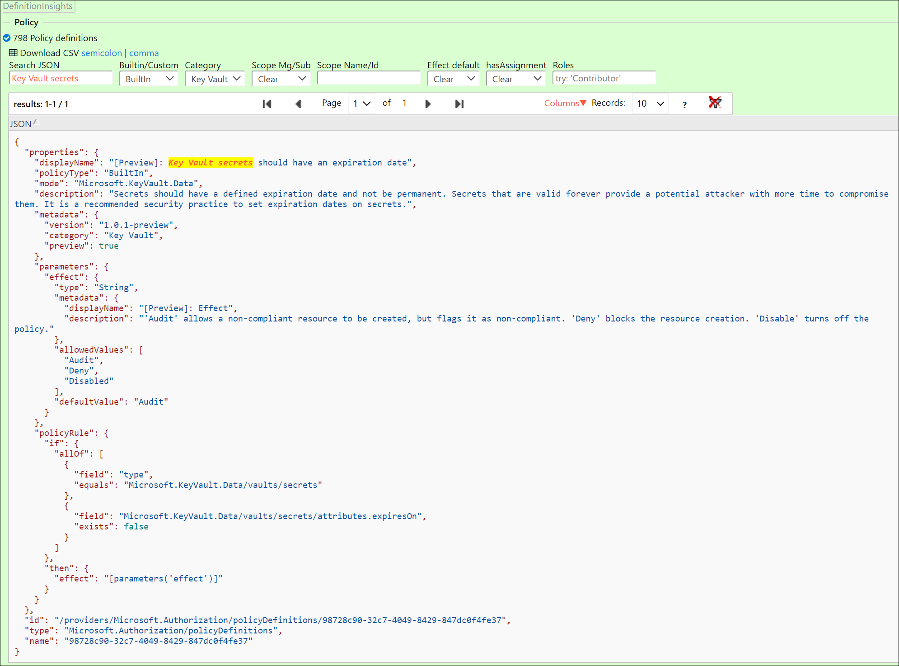
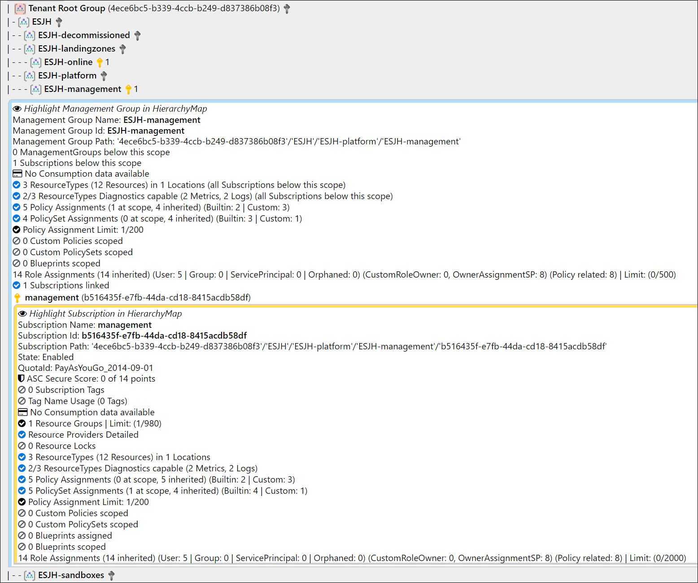
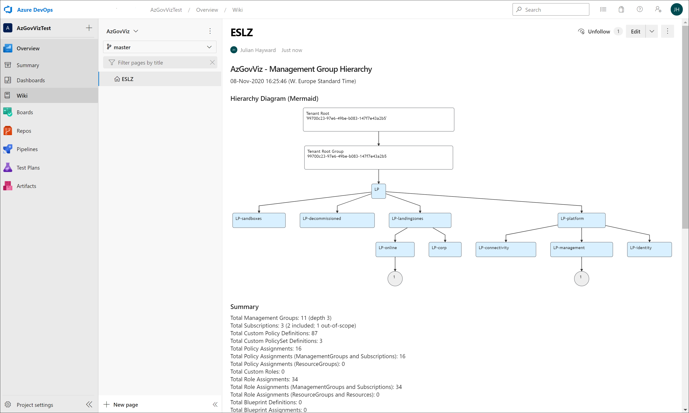
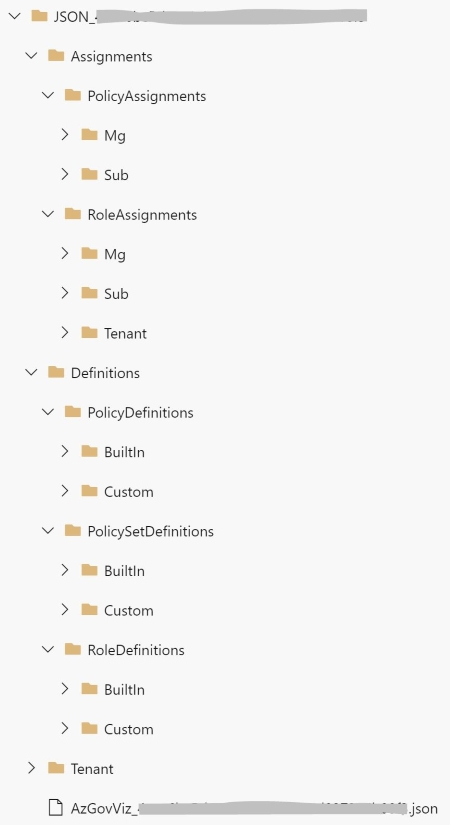
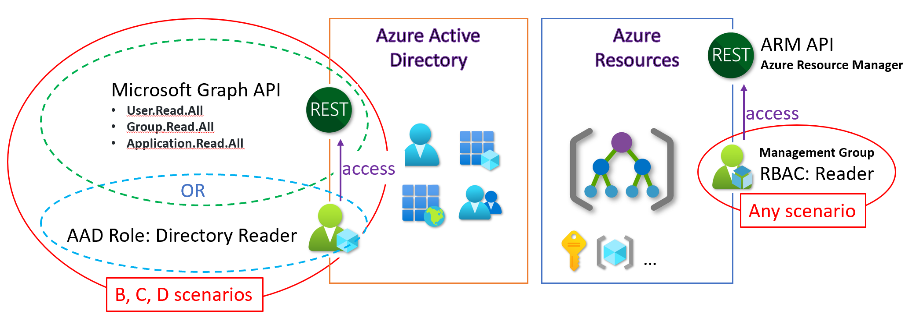

# AzGovViz - Azure Governance Visualizer

Do you want to get granular insights on your technical Azure Governance implementation? - document it in CSV, HTML, Markdown and JSON?  
AzGovViz is a PowerShell based script that iterates your Azure Tenant´s Management Group hierarchy down to Subscription level. It captures most relevant Azure governance capabilities such as Azure Policy, RBAC and Blueprints and a lot more. From the collected data AzGovViz provides visibility on your __HierarchyMap__, creates a __TenantSummary__, creates __DefinitionInsights__ and builds granular __ScopeInsights__ on Management Groups and Subscriptions. The technical requirements as well as the required permissions are minimal.

You can run the script either for your Tenant Root Group or any other Management Group.

## Mission

<table>
<td>

"_Governance can be a complex thing_.."

Challenges:

 * Holistic overview on governance implementation  
 * Connecting the dots

__AzGovViz is intended to help you to get a holistic overview on your technical Azure Governance implementation by connecting the dots__

</td>
<td>


</td>
</table>

## Microsoft Cloud Adoption Framework (CAF)

 Listed as tool for the Govern discipline in the Microsoft Cloud Adoption Framework!  
https://docs.microsoft.com/en-us/azure/cloud-adoption-framework/reference/tools-templates#govern

Included in the Microsoft Cloud Adoption Framework´s [Strategy-Plan-Ready-Gov](https://azuredevopsdemogenerator.azurewebsites.net/?name=strategyplan) Azure DevOps Demo Generator template.

## Content
* [Release history](#release-history)
* [Demo](#demo)
  * [Media](#media)
  * [Slideset](#slideset)
* [Features](#features)
* [Screenshots](#screenshots)
* [Outputs](#outputs)
* __[AzGovViz Setup Guide](#azgovviz-setup-guide)__
* [Technical documentation](#technical-documentation)
  * [Permissions overview](#permissions-overview)
  * [Required permissions in Azure](#required-permissions-in-azure)
  * [Required permissions in Azure Active Directory](#required-permissions-in-azure-active-directory)
  * [PowerShell](#powershell)
  * [Parameters](#parameters)
* [Integrate with AzOps](#integrate-with-azops)
* [Security](#security)
* [Facts](#facts)
* [Contributions](#contributions)
* [AzAdvertizer](#azadvertizer)
* [Final note](#final-note)

## Release history

__Changes__ (2021-Sep-07 / Major)

* Update AzAPICall CostManagement return

__Changes__ (2021-Sep-03 / Major)

* AzAPICall enhanced error handling

__Changes__ (2021-Sep-01 / Major)

* Update AzAPICall CostManagement return

__Changes__ (2021-Aug-30 / Major)

* Adding feature for RBAC Role assignments: determine 'standing' from PIM (Priviledged Identity Mangement) managed Role assignments
* New parameter `-NoResources` - this will speed up the processing time but information like Resource diagnostics capability and resource type stats will not be made available (featured for large tenants)
* Integrate AzGovViz with AzOps (after 'AzOps - Push' run AzGovViz) - (line 77 AzGovViz.yml). Checkout [AzOps Accellerator](https://github.com/Azure/AzOps-Accelerator)
* Performance optimization

[Release history](history.md)

## Demo

<a href="https://www.azadvertizer.net/azgovvizv4/demo/AzGovViz_Enterprise-Scale_WingTip_v5_major_20210818_2.html" target="_blank"></a>

[Demo (v5_major_20210818_2)](https://www.azadvertizer.net/azgovvizv4/demo/AzGovViz_Enterprise-Scale_WingTip_v5_major_20210818_2.html)  
Enterprise-Scale ([WingTip](https://github.com/Azure/Enterprise-Scale/blob/main/docs/reference/wingtip/README.md)) implementation

More [demo output](https://github.com/JulianHayward/AzGovViz)

### Media

* Microsoft Dev Radio (YouTube) [Get visibility into your environment with AzGovViz](https://www.youtube.com/watch?v=hZXvF5oypLE)  
* Jack Tracey (Cloud Solution Architect Microsoft) [AzGovViz With Azure DevOps](https://jacktracey.co.uk/azgovviz-with-azure-devops/)

### Slideset

Short presentation on AzGovViz [Download](slides/AzGovViz_intro.pdf)

## Features

* __Hierarchy of Management Groups__
  * Builds a visual hierarchy of your Management Group setup including counts on linked Subscriptions, Policy assignments, scoped Policy/Set definitions and Role assignments per Management Group
* __Azure Policy__
  * Custom Policy definitions
    * Scope information
    * Policy effect
    * If Policy effect is DeployIfNotExists (DINE) will show the specified RBAC Role 
    * List of assignments
    * Usage in custom PolicySet definitions 
    * System metadata 'createdOn, createdBy, updatedOn, updatedBy' ('createdBy', 'updatedBy' identity is fully resolved)
  * Orphaned custom Policy definitions
    * List of custom Policy definitions that matches the following criteria:
      * Policy definition is not used in any custom PolicySet definition
      * No Policy assignment exists for the Policy definition
  * Custom PolicySet definitions
    * Scope information
    * List unique assignments
    * List of Policy definitions used
  * Orphaned custom PolicySet definitions
    * Criteria: no Policy assignment exists for the PolicySet definition
  * Custom PolicySet definitions using deprecated built-in Policy definitions
  * Policy assignments of deprecated built-in Policy definition
  * Policy Exemptions
    * Lists all Exemptions (scopes: Management Groups, Subscriptions, ResourceGroups, Resources)
    * Enrich information on Exemption scope
    * Summary on expired Exemptions
  * Policy assignments throughout the entirety of scopes (Management Groups, Subscriptions and Resource Groups)
    * Core information on Policy assignments
      * NonCompliance Message on Policy assignment for a PolicySet will only show the default non-compliance message
    * Advanced/enriched information on Policy assignments
      * Policy assignment scope (at scope/inheritance)
      * Indicates if scope is excluded from Policy assignment 
      * Indicates if Exemption applies for scope 
      * Policy/Resource Compliance (Policy: NonCompliant, Compliant; Resource: NonCompliant, Compliant, Conflicting)
      * Related RBAC Role assignments (if Policy effect is DeployIfNotExists (DINE))
      * System metadata 'createdOn, createdBy, updatedOn, updatedBy' ('createdBy', 'updatedBy' identity is fully resolved)
      * Parameters used
* __Role-Based Access Control (RBAC)__
  * Custom Role definitions
    * List assignable scopes
    * System metadata 'createdOn, createdBy, updatedOn, updatedBy' ('createdBy', 'updatedBy' identity is fully resolved)
  * Orphaned custom Role definitions
    * List of custom Role definitions that matches the following criteria:
      * Role definition is not used in any Role assignment
      * Role is not used in a Policy definition´s rule (roleDefinitionIds)
  * Orphaned Role assignments
    * List of Role assignments that matches the following criteria:
      * Role definition was deleted although and assignment existed
      * Role assignmet's target identity (User, Group, ServicePrincipal) was deleted
  * Role assignments throughout the entirety of scopes (Management Groups, Subscriptions, Resource Groups and Resources)
    * Core information on Role assignments
    * Advanced information on Role assignments
      * Role assignment scope (at scope / inheritance)
      * For Role Assignments on Groups the AAD Group members are fully resolved. With this capability AzGovViz can ultimately provide holistic insights on permissions granted
      * For Role Assignments on Groups the AAD Group members count (transitive) will be reported
      * For identity-type == 'ServicePrincipal' the type (Application/ManagedIdentity) will be reported
      * For identity-type == 'User' the userType (Member/Guest) will be reported
      * Related Policy assignments (Policy assignment of a Policy definition that uses the DeployIfNotExists (DINE) effect)
      * System metadata 'createdOn, createdBy' ('createdBy' identity is fully resolved)
      * Determine if the Role assignment is 'standing' or PIM managed
  * Role assignments ClassicAdministrators
  * Security & Best practice analysis
    * Existence of custom Role definition that reflect 'Owner' permissions
    * Role assignments for 'Owner' permissions on identity-type == 'ServicePrincipal' 
    * Role assignments for 'Owner' permissions on identity-type != 'Group'
    * Role assignments for 'User Access Administrator' permissions on identity-type != 'Group'
    * High priviledge Role assignments for 'Guest Users' (Owner & User Access Administrator)
* __Blueprints__
  * Blueprint scopes and assignments
  * Orphaned Blueprints
* __Management Groups__
  * Management Group count, level/depth, MG children, Sub children
  * Hierarchy Settings | Default Management Group Id
  * Hierarchy Settings | Require authorization for Management Group creation
* __Subscriptions, Resources__
  * Subscription insights
    * QuotaId, State, Tags, Azure Security Center Secure Score, Cost, Management Group path
  * Tag Name usage
    * Insights on usage of Tag Names on Subscriptions, ResourceGroups and Resources
  * Resources
    * Resource Types
      * ResourceType count per location
      * Resource Provider
        * Resource Provider state aggregation throughout all Subscriptions
        * Explicit Resource Provider state per Subscription
      * Resource Locks
        * Aggregated insights for Lock and respective Lock-type usage on Subscriptions, ResourceGroups and Resources
* __Diagnostics__
  * Management Groups Diagnostic settings report
    * Management Group, Diagnostic setting name, target type (LA, SA, EH), target Id, Log Category status
  * Subscriptions Diagnostic settings report
    * Subscription, Diagnostic setting name, target type (LA, SA, EH), target Id, Log Category status
  * Resources Diagnostic capabilty report (1st party Resource types only)
    * ResourceType capability for Resource Diagnostics including
      * ResourceType count and information if capable for logs including list of available og categories
      * ResourceType count and information if capable for metrics
  * Lifecyle recommendations for existing Azure Policy definitions that configure Resource diagnostics of type=Log
    * Check if Policy definitions hold the latest set of applicable log categories
    * Recommendation to create Policy definition for ResourceType if supported
    * Lists all PolicyDefinitions that deploy Resource diagnostics of type=log, lists Policy assignments and PolicySet assignments if the Policy defintion is used in a PolicySet definition
* __Limits__
  * Tenant approaching ARM limits:
    * Custom Role definitions
    * PolicySet definitions
  * Management Groups approaching ARM limits:
    * Policy assignment limit
    * Policy / PolicySet definition scope limit
    * Role assignment limit
  * Subscriptions approaching ARM limits:
    * ResourceGroup limit
    * Subscription Tags limit
    * Policy assignment limit
    * Policy / PolicySet definition scope limit
    * Role assignment limit
* __Azure Active Directory (AAD)__
  * Insights on those Service Principals where a Role assignment exists (scopes: Management Group, Subscription, ResourceGroup, Resource):
    * Type=ManagedIdentity
      * Core information on the Service Principal such as related Ids and use case information
    * Type=Application
      * Secrets and Certificates expiry information & warning
      * Report on external Service Principals
* __Consumption__
  * Aggregated consumption insights throughout the entirety of scopes (Management Groups, Subscriptions)
* __Change tracking__
  * Policy
    * Created/Updated Policy and PolicySet definitions (system metadata 'createdOn, createdBy, updatedOn, updatedBy')
    * Created/Updated Policy assignments (system metadata 'createdOn, createdBy, updatedOn, updatedBy')
  * RBAC
    * Created/Updated Role definitions (system metadata 'createdOn, createdBy, updatedOn, updatedBy')
    * Created Role assignments (system metadata 'createdOn, createdBy)
  * Resources
    * Aggregated insights on Created/Changed Resources

## Screenshots

HTML file

__HierarchyMap__  
  
__TenantSummary__  
  
__DefinitionInsights__  
 
__ScopeInsights__  
  
*_IDs from screenshot are randomized_

markdown in Azure DevOps Wiki as Code

 
*_IDs from screenshot are randomized_
> Note: there is some fixing ongoing at the mermaid project to optimize the graphical experience:  
 <https://github.com/mermaid-js/mermaid/issues/1177>

## Outputs

* CSV file
* HTML file
  * the HTML file uses Java Script and CSS files which are hosted on various CDNs (Content Delivery Network). For details review the BuildHTML region in the PowerShell script file.
  * Browsers tested: Edge, new Edge and Chrome
* MD (Markdown) file
  * for use with Azure DevOps Wiki leveraging the [Mermaid](https://docs.microsoft.com/en-us/azure/devops/release-notes/2019/sprint-158-update#mermaid-diagram-support-in-wiki) plugin
* JSON folder ([demo-output](https://github.com/JulianHayward/AzGovViz)) containing 
  * all Policy and Role assignments (Scopes: Tenant, Management Groups and Subscriptions)
  * all BuiltIn and Custom Policy/Set definitions (Scopes: Management Groups and Subscriptions)
  * all BuiltIn and Custom Role definitions
  * JSON file of ManagementGroup Hierarchy including all Custom Policy/Set and RBAC definitions, Policy and Role assignments and some more relevant information 
  * Tenant tree including all Policy and Role assignments AND all Custom Policy/Set and Role definitions   
  

## AzGovViz Setup Guide

&#x1F4A1; Detailed __[Setup Guide](setup.md)__

## Technical documentation

### Permissions overview



### Required permissions in Azure

This permission is <b>mandatory</b> in each and every scenario!

<table>
  <tbody>
    <tr>
      <th>Scenario</th>
      <th>Permissions</th>
    </tr>
    <tr>
      <td><b>ANY</b><br>Console or AzureDevOps Pipeline</td>
      <td><b>Reader</b> Role assignment on <b>Management Group</b></td>
    </tr>
  </tbody>
</table>

### Required permissions in Azure Active Directory

<table>
  <tbody>
    <tr>
      <th>Scenario</th>
      <th>Permissions</th>
    </tr>
    <tr>
      <td><b>A</b><br>Console | Member user account</td>
      <td>No AAD permissions required
      </td>
    </tr>
    <tr>
      <td><b>B</b><br>Console | Guest user account</td>
      <td>Add assignment for the Guest user to AAD Role <b>Directory readers</b><br>OR<br>Use parameters:<br>&nbsp;-NoAADGuestUsers<br>&nbsp;-NoAADGroupsResolveMembers<br>&nbsp;-NoAADServicePrincipalResolve<br>
      &#x1F4A1; <a href="https://github.com/MicrosoftDocs/azure-docs/blob/master/articles/active-directory/fundamentals/users-default-permissions.md#compare-member-and-guest-default-permissions" target="_blank">Compare member and guest default permissions</a>
      </td>
    </tr>
    <tr>
      <td><b>C</b><br>Console | Service Principal</td>
      <td>
        <b>Option 1</b> (simple setup but more read permissions than required)<br>
        Add assignment for the Service Principal to AAD Role <b>Directory readers</b><br>&#x1F4A1; <a href="https://github.com/MicrosoftDocs/azure-docs/blob/master/articles/active-directory/roles/permissions-reference.md#directory-readers" target="_blank">Directory readers</a><br><br>
        <b>Option 2</b> (explicit permission model)
        <table>
          <tbody>
            <tr>
              <th>Feature</th>
              <th>Permissions</th>
              <th>Parameter</th>
            </tr>
            <tr>
              <td>Get identity<br>Role assignments</td>
              <td>Service Principal's <b>App registration</b><br>grant with <b>Azure Active Directory Graph</b> permissions:<br>Application permissions / Directory / Read.All<br>&#x1F4A1; <a href="https://docs.microsoft.com/en-us/previous-versions/azure/ad/graph/howto/azure-ad-graph-api-permission-scopes#permission-scope-details-" target="_blank">Read directory data</a></td>
              <td>n/a</td>
            </tr>
            <tr>
              <td>Get AAD<br>Guest Users</td>
              <td>Service Principal's <b>App registration</b><br>grant with <b>Microsoft Graph</b> permissions:<br>Application permissions / User / User.Read.All<br>&#x1F4A1; <a href="https://docs.microsoft.com/en-us/graph/api/user-get#permissions" target="_blank">Get user</a></td>
              <td>NoAADGuestUsers</td>
            </tr>
            <tr>
              <td>Get AAD<br>Groups</td>
              <td>Service Principal's <b>App registration</b><br>grant with <b>Microsoft Graph</b> permissions:<br>Application permissions / Group / Group.Read.All<br>&#x1F4A1; <a href="https://docs.microsoft.com/en-us/graph/api/group-get#permissions" target="_blank">Get group</a></td>
              <td>NoAADGroupsResolveMembers</td>
            </tr>
            <tr>
              <td>Get AAD<br>SP/App</td>
              <td>Service Principal's <b>App registration</b><br>grant with <b>Microsoft Graph</b> permissions:<br>Application permissions / Application / Application.Read.All<br>&#x1F4A1; <a href="https://docs.microsoft.com/en-us/graph/api/serviceprincipal-get#permissions" target="_blank">Get servicePrincipal</a>, <a href="https://docs.microsoft.com/en-us/graph/api/application-get#permissions" target="_blank">Get application</a></td>
              <td>NoAADServicePrincipalResolve</td>
            </tr>
          </tbody>
        </table>
      </td>
    </tr>
    <tr>
      <td><b>D</b><br>Azure DevOps Pipeline | ServicePrincipal (Service Connection)</td>
      <td>
        <b>Option 1</b> (simple setup but more read permissions than required)<br>
        Add assignment for the Azure DevOps Service Connection's Service Principal to AAD Role <b>Directory readers</b><br>&#x1F4A1; <a href="https://github.com/MicrosoftDocs/azure-docs/blob/master/articles/active-directory/roles/permissions-reference.md#directory-readers" target="_blank">Directory readers</a><br><br>
        <b>Option 2</b> (explicit permission model)
        <table>
          <tbody>
            <tr>
              <th>Feature</th>
              <th>Permissions</th>
              <th>Parameter</th>
            </tr>
            <tr>
              <td>Get identity<br>Role assignments</td>
              <td>Azure DevOps Service Connection's <b>App registration</b><br>grant with <b>Azure Active Directory Graph</b> permissions:<br>Application permissions / Directory / Read.All<br>&#x1F4A1; <a href="https://docs.microsoft.com/en-us/previous-versions/azure/ad/graph/howto/azure-ad-graph-api-permission-scopes#permission-scope-details-" target="_blank">Read directory data</a></td>
              <td>n/a</td>
            </tr>
            <tr>
              <td>Get AAD<br>Guest Users</td>
              <td>Azure DevOps Service Connection's <b>App registration</b><br>grant with <b>Microsoft Graph</b> permissions:<br>Application permissions / User / User.Read.All<br>&#x1F4A1; <a href="https://docs.microsoft.com/en-us/graph/api/user-get#permissions" target="_blank">Get user</a></td>
              <td>NoAADGuestUsers</td>
            </tr>
            <tr>
              <td>Get AAD<br>Groups</td>
              <td>Azure DevOps Service Connection's <b>App registration</b><br>grant with <b>Microsoft Graph</b> permissions:<br>Application permissions / Group / Group.Read.All<br>&#x1F4A1; <a href="https://docs.microsoft.com/en-us/graph/api/group-get#permissions" target="_blank">Get group</a></td>
              <td>NoAADGroupsResolveMembers</td>
            </tr>
            <tr>
              <td>Get AAD<br>SP/App</td>
              <td>Azure DevOps Service Connection's <b>App registration</b><br>grant with <b>Microsoft Graph</b> permissions:<br>Application permissions / Application / Application.Read.All<br>&#x1F4A1; <a href="https://docs.microsoft.com/en-us/graph/api/serviceprincipal-get#permissions" target="_blank">Get servicePrincipal</a>, <a href="https://docs.microsoft.com/en-us/graph/api/application-get#permissions" target="_blank">Get application</a></td>
              <td>NoAADServicePrincipalResolve</td>
            </tr>
          </tbody>
        </table>
      </td>
    </tr>
  </tbody>
</table>

Permissions in Azure Active Directory for App registration:  


### PowerShell

* Requires PowerShell 7 (minimum supported version 7.0.3)
  * [Get PowerShell](https://github.com/PowerShell/PowerShell#get-powershell)
  * [Installing PowerShell on Windows](https://docs.microsoft.com/en-us/powershell/scripting/install/installing-powershell-core-on-windows)
  * [Installing PowerShell on Linux](https://docs.microsoft.com/en-us/powershell/scripting/install/installing-powershell-core-on-linux)
* Requires PowerShell Az Modules
  * Az.Accounts
  * Az.Resources
  * ~~Az.ResourceGraph~~
  * [Install the Azure Az PowerShell module](https://docs.microsoft.com/en-us/powershell/azure/install-az-ps)
* Usage/command
  * `.\AzGovVizParallel.ps1 -ManagementGroupId <your-Management-Group-Id>`

### Parameters
  * `-ManagementGroupId` Management Group Id (Root Management Group Id equals your Tenant Id)
  * `-CsvDelimiter` - The world is split into two kinds of delimiters - comma and semicolon - choose yours (default is semicolon ';')
  * `-OutputPath` 
  * `-AzureDevOpsWikiAsCode` - Use this parameter only when running AzGovViz in a Azure DevOps Pipeline
  * `-DoNotShowRoleAssignmentsUserData` - Scrub personally identifiable information (PII)
  * `-LimitCriticalPercentage` - Limit warning level, default is 80%
  * ~~`-HierarchyTreeOnly`~~ `-HierarchyMapOnly` - Output only the __HierarchyMap__ for Management Groups including linked Subscriptions
  * `-SubscriptionQuotaIdWhitelist` - Process only Subscriptions with defined QuotaId(s). Example: .\AzGovVizParallel.ps1 `-SubscriptionQuotaIdWhitelist MSDN_,Enterprise_`
  * `-NoResourceProvidersDetailed` - Disables output for ResourceProvider states for all Subscriptions in the __TenantSummary__ section, in large Tenants this can become time consuming
  * `-NoASCSecureScore` - Disables ASC Secure Score request for Subscriptions and Management Groups.
  * ~~`-DisablePolicyComplianceStates`~~ `-NoPolicyComplianceStates` - Will not query policy compliance states. You may want to use this parameter to accellerate script execution or when receiving error 'ResponseTooLarge'. 
  * `-NoResourceDiagnosticsPolicyLifecycle` - Disables Resource Diagnostics Policy Lifecycle recommendations
  * `-NoAADGroupsResolveMembers` - Disables resolving Azure Active Directory Group memberships
  * `-NoAADGuestUsers` - Disables resolving Azure Active Directory User type (Guest or Member)
  * ~~`-NoServicePrincipalResolve`~~ `-NoAADServicePrincipalResolve` - Disables resolving ServicePrincipals
  * ~~`-ServicePrincipalExpiryWarningDays`~~ `-AADServicePrincipalExpiryWarningDays` - Define warning period for Service Principal secret and certificate expiry; default is 14 days
  * `-NoAzureConsumption` - Azure Consumption data should not be collected/reported
  * `-AzureConsumptionPeriod` - Define for which time period Azure Consumption data should be gathered; default is 1 day
  * `-NoAzureConsumptionReportExportToCSV` - Azure Consumption data should not be exported (CSV)
  * `-NoScopeInsights` - Q: Why would you want to do this? A: In larger tenants the ScopeInsights section blows up the html file (up to unusable due to html file size). Use `-LargeTenant` to further reduce the output.
  * `-ThrottleLimit` - leveraging PowerShell´s parallel capability you can define the ThrottleLimit (default=5; &#x1F4A1; values from 5 up to 15 proved to perform best)
  * `-DoTranscript` - Log the console output
  * `-SubscriptionId4AzContext` - Define the Subscription Id to use for AzContext (default is to use a random Subscription Id)
  * `-PolicyAtScopeOnly` - Removing 'inherited' lines in the HTML file for 'Policy Assignments'; use this parameter if you run against a larger tenants. Note using parameter `-LargeTenant` will set `-PolicyAtScopeOnly $true`
  * `-RBACAtScopeOnly` - Removing 'inherited' lines in the HTML file for 'Role Assignments'; use this parameter if you run against a larger tenants. Note using parameter `-LargeTenant` will set `-RBACAtScopeOnly $true`
  * ~~`-CsvExport`~~ `-NoCsvExport` - Do not export enriched data for 'Role assignments', 'Policy assignments' data and 'all resources' (subscriptionId,  managementGroup path, resourceType, id, name, location, tags, createdTime, changedTime)
  * ~~`-PolicyIncludeResourceGroups`~~ `-DoNotIncludeResourceGroupsOnPolicy` - Do not include Policy assignments on ResourceGroups
  * ~~`-RBACIncludeResourceGroupsAndResources`~~ `-DoNotIncludeResourceGroupsAndResourcesOnRBAC` - Do not include Role assignments on ResourceGroups and Resources
  * `-ChangeTrackingDays` - Define the period for Change tracking on newly created and updated custom Policy, PolicySet and RBAC Role definitions and Policy/RBAC Role assignments (default is '14') 
  * `-FileTimeStampFormat`- Define the time format for the output files (default is `yyyyMMdd_HHmmss`)
  * ~~`-JsonExport`~~ `-NoJsonExport` - Do not enable export of ManagementGroup Hierarchy including all MG/Sub Policy/RBAC definitions, Policy/RBAC assignments and some more relevant information to JSON 
  * `-JsonExportExcludeResourceGroups` - JSON Export will not include ResourceGroups (Policy & Role assignments)
  * `-JsonExportExcludeResources`- JSON Export will not include Resources (Role assignments)
  * `-LargeTenant` - A large tenant is a tenant with more than ~500 Subscriptions - the HTML output for large tenants simply becomes too big. Using this parameter the following parameters will be set: -PolicyAtScopeOnly $true, -RBACAtScopeOnly $true, -NoResourceProvidersDetailed $true, -NoScopeInsights $true
  * `-HtmlTableRowsLimit` - Although the parameter `-LargeTenant` was introduced recently, still the html output may become too large to be processed properly. The new parameter defines the limit of rows - if for the html processing part the limit is reached then the html table will not be created (csv and json output will still be created). Default rows limit is 40.000
  * `-AADGroupMembersLimit` - Defines the limit (default=500) of AAD Group members; For AAD Groups that have more members than the defined limit Group members will not be resolved 
  * `-NoResources` - Will speed up the processing time but information like Resource diagnostics capability and resource type stats (featured for large tenants)

* Passed tests: Powershell Core 7.1.3 on Windows
* Passed tests: Powershell Core 7.1.3 Azure DevOps hosted ubuntu-18.04

## Integrate with AzOps

Did you know you can run AzOps from Azure DevOps? Check [AzOps Accellerator](https://github.com/Azure/AzOps-Accelerator).  
You can integrate AzGovViz (same project as AzOps).

```yaml
  pipelines:
    - pipeline: 'Push'
      source: 'AzOps - Push'
      trigger:
        branches:
          include:
            - master
```

## Security

AzGovViz creates very detailed information about your Azure Governance setup. In your organization's best interest the __outputs should be protected from not authorized access!__

## Facts

Disabled Subscriptions and Subscriptions where Quota Id starts with with "AAD_" are being skipped, all others are queried. More info on Quota Id / Offer numbers: <a href="https://docs.microsoft.com/en-us/azure/cost-management-billing/costs/understand-cost-mgt-data#supported-microsoft-azure-offers" target="_blank">Supported Microsoft Azure offers</a> 
.  

ARM Limits are not acquired programmatically, they are hardcoded. The links used to check related Limits are commented in the param section of the script.

## Contributions

Please feel free to contribute. Thanks to so many supporters - testing, giving feedback, making suggestions, presenting use-case, posting/blogging articles, refactoring code - THANK YOU!

Thanks Stefan Stranger (Microsoft) for providing me with his AzGovViz outputs executed on his implementation of EnterpriseScale. Make sure you read Stefan´s Blog Article: <a href="https://stefanstranger.github.io/2020/08/28/EnterpriseScalePolicyDrivenGovernance/" target="_blank">Enterprise-Scale - Policy Driven Governance</a> 

Thanks Frank Oltmanns-Mack (Microsoft) for providing me with his AzGovViz outputs executed on his implementation of EnterpriseScale.

Special thanks to Tim Wanierke, Brooks Vaughn and Friedrich Weinmann (Microsoft).

Kudos to the <a href="https://www.tablefilter.com/" target="_blank">TableFilter</a> Project Team!

## AzAdvertizer


Also check <https://www.azadvertizer.net> - AzAdvertizer helps you to keep up with the pace by providing overview and insights on new releases and changes/updates for Azure Governance capabilities such as Azure Policy's Policy definitions, initiatives (Set definitions), aliases and Azure RBAC's Role definitions and resource provider operations.

## Final Note

Please note that while being developed by a Microsoft employee, AzGovViz is not a Microsoft service or product. AzGovViz is a personal/community driven project, there are none implicit or explicit obligations related to this project, it is provided 'as is' with no warranties and confer no rights.