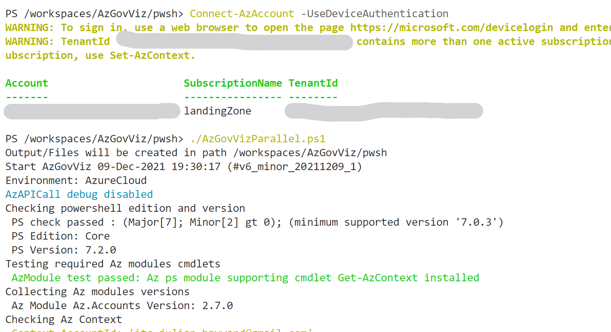
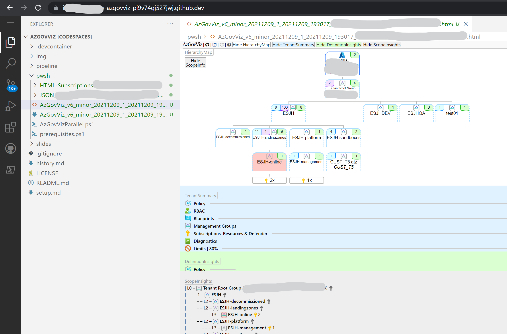
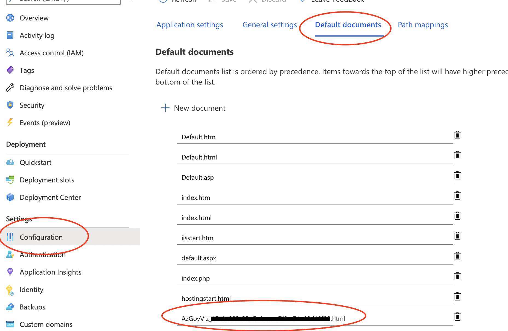
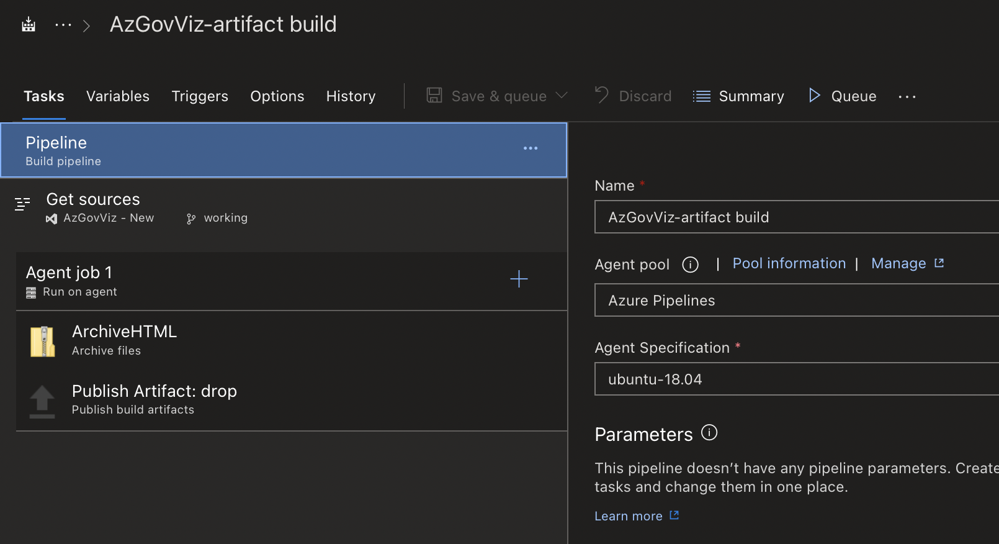
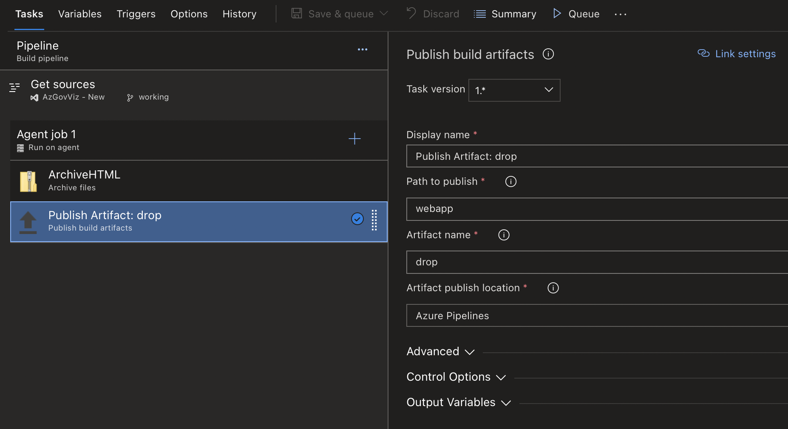
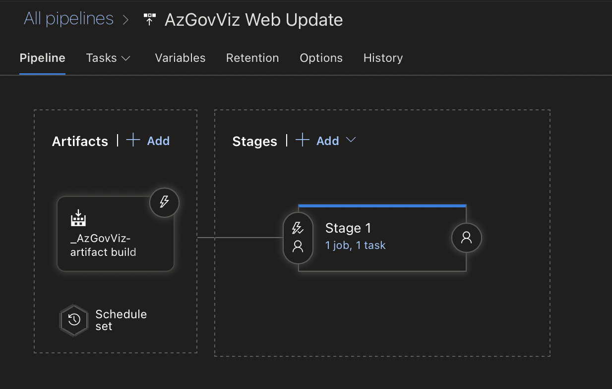
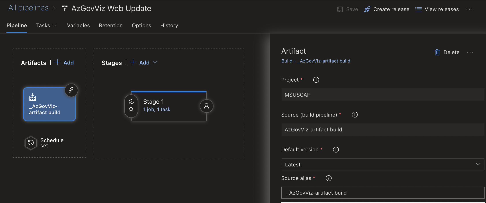
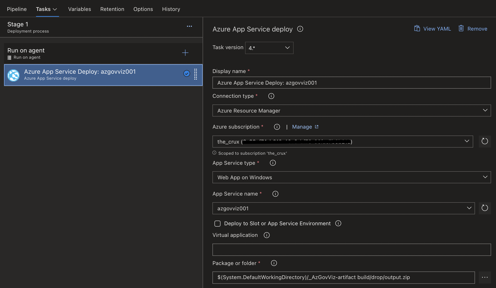

# AzGovViz - Azure Governance Visualizer - Setup

This guide will help you to setup and run AzGovViz

* Abbreviations:
    * Azure Active Directory - AAD
    * Azure DevOps - AzDO

## Table of contents

* [__AzGovViz from Console__](#azgovviz-from-console)
    * Grant permissions in Azure
    * Execution options
      * Option 1 - Execute as a Tenant Member User
      * Option 2 - Execute as a Tenant Guest User
      * Option 3 - Execute as Service Principal
    * Clone the AzGovViz repository
    * Run AzGovViz

* [__AzGovViz in Azure DevOps (AzDO)__](#azgovviz-in-azure-devops)
    * Create AzDO Project
    * Import AzGovViz GitHub repository
    * Create AzDO Service Connection
      * Option 1 - Create Service Connection in AzDO
      * Option 2 - Create Service Connection´s Service Principal in the Azure Portal
    * Grant permissions in Azure
    * Grant permissions in AAD
    * Grant permissions on AzGovViz AzDO repository
    * Edit AzDO YAML file
    * Create AzDO Pipeline
    * Run the AzDO Pipeline
    * Create AzDO Wiki - WikiAsCode

* [__AzGovViz in GitHub Actions__](#azgovviz-in-github-actions)
    * Create GitHub repository
    * Import Code
    * AzGovViz YAML
        * Store the credentials in GitHub
        * Edit the workflow YAML file
        * Run AzGovViz in GitHub Actions
    * AzGovViz OIDC YAML
        * Store the credentials in GitHub
        * Edit the workflow YAML file
        * Run AzGovViz in GitHub Actions

* [__AzGovViz in GitHub Codespaces__](#azgovviz-github-codespaces)

# AzGovViz from Console

## Grant permissions in Azure

* Requirements
    * To assign roles, you must have '__Microsoft.Authorization/roleAssignments/write__' permissions on the target Management Group scope (such as the built-in RBAC Role '__User Access Administrator__' or '__Owner__')

Create a '__Reader__' RBAC Role assignment on the target Management Group scope for the identity that shall run AzGovViz

* PowerShell

```powershell
$objectId = "<objectId of the identity that shall run AzGovViz>"
$role = "Reader"
$managementGroupId = "<managementGroupId>"

New-AzRoleAssignment `
-ObjectId $objectId `
-RoleDefinitionName $role `
-Scope /providers/Microsoft.Management/managementGroups/$managementGroupId
```

* Azure Portal
[Assign Azure roles using the Azure portal](https://docs.microsoft.com/en-us/azure/role-based-access-control/role-assignments-portal)

## Execution options

### Option 1 - Execute as a Tenant Member User

Proceed with step [__Clone the AzGovViz repository__](#clone-the-azgovviz-repository)

### Option 2 - Execute as a Tenant Guest User

If the tenant is hardened (AAD External Identities / Guest user access = most restrictive) then Guest User must be assigned the AAD Role '__Directory readers__'

&#x1F4A1; [Compare member and guest default permissions](https://github.com/MicrosoftDocs/azure-docs/blob/master/articles/active-directory/fundamentals/users-default-permissions.md#compare-member-and-guest-default-permissions)
&#x1F4A1; [Restrict Guest permissions](https://docs.microsoft.com/en-us/azure/active-directory/enterprise-users/users-restrict-guest-permissions)

#### Assign AAD Role - Directory readers

* Requirements
    * To assign roles, you must have '__Privileged Role Administrator__' or '__Global Administrator__' role assigned [Assign Azure AD roles to users](https://docs.microsoft.com/en-us/azure/active-directory/roles/manage-roles-portal)

Assign the AAD Role '__Directory Reader__' for the Guest User that shall run AzGovViz (work with the Guest User´s display name)

* Azure Portal
    * [Assign a role](https://docs.microsoft.com/en-us/azure/active-directory/roles/manage-roles-portal#assign-a-role)

Proceed with step [__Clone the AzGovViz repository__](#clone-the-azgovviz-repository)

### Option 3 - Execute as Service Principal

A Service Principal by default has no read permissions on Users, Groups and Service Principals, therefore we need to grant additional permissions in AAD

#### Grant API permissions

* Requirements
    * To grant API permissions and grant admin consent for the directory, you must have '__Privileged Role Administrator__' or '__Global Administrator__' role assigned [Assign Azure AD roles to users](https://docs.microsoft.com/en-us/azure/active-directory/roles/manage-roles-portal)

Grant API permissions for the Service Principal´s Application

* Navigate to 'Azure Active Directory'
* Click on '__App registrations__'
* Search for the Application that we created earlier and click on it
* Under '__Manage__' click on '__API permissions__'
    * Click on '__Add a permissions__'
    * Click on '__Microsoft Graph__'
    * Click on '__Application permissions__'
    * Select the following set of permissions and click '__Add permissions__'
        * __Application / Application.Read.All__
        * __Group / Group.Read.All__
        * __User / User.Read.All__
    * Click on 'Add a permissions'
    * Back in the main '__API permissions__' menu you will find 3 permissions with status 'Not granted for...'. Click on '__Grant admin consent for _TenantName___' and confirm by click on '__Yes__'
    * Now you will find the 3 permissions with status '__Granted for _TenantName___'

Permissions in Azure Active Directory for App registration:


Proceed with step [__Clone the AzGovViz repository__](#clone-the-azgovviz-repository)

## Clone the AzGovViz repository

* Requirements
  * To clone the AzGovViz GitHub repository you need to have GIT installed
  * Install Git: [https://git-scm.com/download/win](https://git-scm.com/download/win)

* PowerShell

```powershell
Set-Location "c:\Git"
git clone "https://github.com/JulianHayward/Azure-MG-Sub-Governance-Reporting.git"
```

Proceed with step [__Run AzGovViz from Console__](#run-azgovviz-from-console)

## Run AzGovViz from Console

### PowerShell & Azure PowerShell modules

* Requirements
    * Requires PowerShell 7 (minimum supported version 7.0.3)
        * [Get PowerShell](https://github.com/PowerShell/PowerShell#get-powershell)
        * [Installing PowerShell on Windows](https://docs.microsoft.com/en-us/powershell/scripting/install/installing-powershell-core-on-windows)
        * [Installing PowerShell on Linux](https://docs.microsoft.com/en-us/powershell/scripting/install/installing-powershell-core-on-linux)
    * Requires PowerShell Az Modules
        * Az.Accounts
        * [Install the Azure Az PowerShell module](https://docs.microsoft.com/en-us/powershell/azure/install-az-ps)

### Connecting to Azure as User (Member or Guest)

* PowerShell

```powershell
Connect-AzAccount -TenantId <TenantId> -UseDeviceAuthentication
```

### Connecting to Azure using Service Principal

Have the '__Application (client) ID__' of the App registration OR '__Application ID__' of the Service Principal (Enterprise Application) and the secret of the App registration at hand

* PowerShell

```powershell
$pscredential = Get-Credential
Connect-AzAccount -ServicePrincipal -TenantId <TenantId> -Credential $pscredential
```

User: Enter '__Application (client) ID__' of the App registration OR '__Application ID__' of the Service Principal (Enterprise Application)
Password for user \<Id\>: Enter App registration´s secret

### Run AzGovViz

Familiarize yourself with the available [parameters](https://github.com/JulianHayward/Azure-MG-Sub-Governance-Reporting#usage) for AzGovViz

* PowerShell

```powershell
c:\Git\Azure-MG-Sub-Governance-Reporting\pwsh\AzGovVizParallel.ps1 -ManagementGroupId <target Management Group Id>
```

Note if not using the `-OutputPath` parameter, all outputs will be created in the current directory. The following example will create the outputs in directory c:\AzGovViz-Output (directory must exist)

* PowerShell

```powershell
c:\Git\Azure-MG-Sub-Governance-Reporting\pwsh\AzGovVizParallel.ps1 -ManagementGroupId <target Management Group Id> -OutputPath "c:\AzGovViz-Output"
```

# AzGovViz in Azure DevOps

## Create AzDO Project

[Create a project](https://docs.microsoft.com/en-us/azure/devops/organizations/projects/create-project?view=azure-devops&tabs=preview-page#create-a-project)

## Import AzGovViz GitHub repository

AzGovViz Clone URL: `https://github.com/JulianHayward/Azure-MG-Sub-Governance-Reporting.git`

[Import into a new repo](https://docs.microsoft.com/en-us/azure/devops/repos/git/import-git-repository?view=azure-devops#import-into-a-new-repo)

Note: the AzGovViz GitHub repository is public - no authorization required

## Create AzDO Service Connection

For the pipeline to authenticate and connect to Azure we need to create an AzDO Service Connection which basically is a Service Principal (Application)
There are two options to create the Service Connection:

* Options
    * __Option 1__ Create Service Connection´s Service Principal in the Azure Portal
    * __Option 2__ Create Service Connection in AzDO

### Create AzDO Service Connection - Option 1 - Create Service Connection´s Service Principal in the Azure Portal

#### Azure Portal
* Navigate to 'Azure Active Directory'
* Click on '__App registrations__'
* Click on '__New registration__'
* Name your application (e.g. 'AzGovViz_SC')
* Click '__Register__'
* Your App registration has been created, in the '__Overview__' copy the '__Application (client) ID__' as we will need it later to setup the Service Connection in AzDO
* Under '__Manage__' click on '__Certificates & Secrets__'
* Click on '__New client secret__'
* Provide a good description and choose the expiry time based on your need and click '__Add__'
* A new client secret has been created, copy the secret´s value as we will need it later to setup the Service Connection in AzDO

__Note:__ if you do not assign the RBAC 'Reader' role to the Management group at this stage then the '__Verify__' step in [Azure DevOps](#azure-devops) will fail.
* In the portal proceed to '__Management Groups__', select the scope at which AzGovViz will run, usually __Tenant Root Group__
* Go to '__Access Control (IAM)__', '__Grant Access__' and '__Add Role Assignment__', select '__Reader__', click '__Next__'
* Now '__Select Member__', this will be the name of the Application you created above (e.g. 'AzGovViz_SC').
* Select '__Next__', '__Review + Assign__'  

#### Azure DevOps
* Click on '__Project settings__' (located on the bottom left)
* Under '__Pipelines__' click on '__Service Connections__'
* Click on '__New service connection__' and select the connection/service type '__Azure Resource Manager__' and click '__Next__'
* For the authentication method select '__Service principal (manual)__' and click '__Next__'
* For the '__Scope level__' select '__Management Group__'
    * In the field '__Management Group Id__' enter the target Management Group Id
    * In the field '__Management Group Name__' enter the target Management Group Name
* Under '__Authentication__' in the field '__Service Principal Id__' enter the '__Application (client) ID__' that you copied away earlier
* For the '__Credential__' select '__Service principal key__', in the field '__Service principal key__' enter the secret that you copied away earlier
* For '__Tenant ID__' enter your Tenant Id
* Click on '__Verify__'
* Under '__Details__' provide your Service Connection with a name and copy away the name as we will need that later when editing the Pipeline YAML file
* For '__Security__' leave the 'Grant access permissions to all pipelines' option checked (optional)
* Click on '__Verify and save__'

### Create AzDO Service Connection - Option 2 - Create Service Connection in AzDO

* Click on '__Project settings__' (located on the bottom left)
* Under '__Pipelines__' click on '__Service connections__'
* Click on '__New service connection__' and select the connection/service type '__Azure Resource Manager__' and click '__Next__'
* For the authentication method select '__Service principal (automatic)__' and click '__Next__'
* For the '__Scope level__' select '__Management Group__', in the Management Group dropdown select the target Management Group (here the Management Group´s display names will be shown), in the '__Details__' section apply a Service Connection name and optional give it a description and click '__Save__'
* A new window will open, authenticate with your administrative account
* Now the Service Connection has been created

__Important!__ In Azure on the target Management Group scope an '__Owner__' RBAC Role assignment for the Service Connection´s Service Principal has been created automatically (we do however only require a '__Reader__' RBAC Role assignment! we will take corrective action in the next steps)

## Grant permissions in Azure

* Requirements
    * To assign roles, you must have '__Microsoft.Authorization/roleAssignments/write__' permissions on the target Management Group scope (such as the built-in RBAC Role '__User Access Administrator__' or '__Owner__')

Create a '__Reader__' RBAC Role assignment on the target Management Group scope for the AzDO Service Connection´s Service Principal

* PowerShell

```powershell
$objectId = "<objectId of the AzDO Service Connection´s Service Principal>"
$role = "Reader"
$managementGroupId = "<managementGroupId>"

New-AzRoleAssignment `
-ObjectId $objectId `
-RoleDefinitionName $role `
-Scope /providers/Microsoft.Management/managementGroups/$managementGroupId
```

* Azure Portal
[Assign Azure roles using the Azure portal](https://docs.microsoft.com/en-us/azure/role-based-access-control/role-assignments-portal)

__Important!__ If you have created the AzDO Service Connection in AzDO (Option 2) then you SHOULD remove the automatically created '__Owner__' RBAC Role assignment for the AzDO Service Connection´s Service Principal from the target Management Group

## Grant permissions in AAD

### API permissions

* Requirements
    * To grant API permissions and grant admin consent for the directory, you must have '__Privileged Role Administrator__' or '__Global Administrator__' role assigned ([Assign Azure AD roles to users](https://docs.microsoft.com/en-us/azure/active-directory/roles/manage-roles-portal))

Grant API permissions for the Service Principal´s Application that we created earlier

* Navigate to 'Azure Active Directory'
* Click on '__App registrations__'
* Search for the Application that we created earlier and click on it
* Under '__Manage__' click on '__API permissions__'
    * Click on '__Add a permissions__'
    * Click on '__Microsoft Graph__'
    * Click on '__Application permissions__'
    * Select the following set of permissions and click '__Add permissions__'
        * __Application / Application.Read.All__
        * __Group / Group.Read.All__
        * __User / User.Read.All__
    * Click on 'Add a permissions'
    * Back in the main '__API permissions__' menu you will find the 3 permissions with status 'Not granted for...'. Click on '__Grant admin consent for _TenantName___' and confirm by click on '__Yes__'
    * Now you will find the 3 permissions with status '__Granted for _TenantName___'

Permissions in Azure Active Directory for App registration:


## Grant permissions on AzGovViz AzDO repository

When the AzDO pipeline executes the AzGovViz script the outputs should be pushed back to the AzGovViz AzDO repository, in order to do this we need to grant the AzDO Project´s Build Service account with 'Contribute' permissions on the repository

* Grant permissions on the AzGovViz AzDO repository
    * In AzDO click on '__Project settings__' (located on the bottom left), under '__Repos__' open the '__Repositories__' page
    * Click on the AzGovViz AzDO Repository and select the tab '__Security__'
    * On the right side search for the Build Service account
     __%Project name% Build Service (%Organization name%)__ and grant it with '__Contribute__' permissions by selecting '__Allow__' (no save button available)

## OPTION 1 (legacy) - Edit AzDO YAML file (.pipelines folder)

* Click on '__Repos__'
* Navigate to the AzGovViz Repository
* In the folder '__pipeline__' click on '__AzGovViz.yml__' and click '__Edit__'
* Under the variables section
    * Enter the Service Connection name that you copied earlier (ServiceConnection)
    * Enter the Management Group Id (ManagementGroupId)
* Click '__Commit__'

## OPTION 1 (legacy) - Create AzDO Pipeline (.pipelines folder)

* Click on '__Pipelines__'
* Click on '__New pipeline__'
* Select '__Azure Repos Git__'
* Select the AzGovViz repository
* Click on '__Existing Azure Pipelines YAML file__'
* Under '__Path__' select '__/.pipelines/AzGovViz.yml__' (the YAML file we edited earlier)
* Click ' __Save__'

## OPTION 2 (new) - Edit AzDO Variables YAML file (.azuredevops folder)

>For the '__parameters__' and '__variables__' sections, details about each parameter or variable is documented inline.

* Click on '__Repos__'
* Navigate to the AzGovViz repository
* In the folder '__/.azuredevops/pipelines__' click on '__AzGovViz.variables.yml__' and click '__Edit__'
* If needed, modify the '__parameters__' section:
  * For more information about [parameters](https://docs.microsoft.com/en-us/azure/devops/pipelines/process/runtime-parameters)
  * [Optional] Update the '__ExcludedResourceTypesDiagnosticsCapableParameters__'
  * [Optional] Update the '__SubscriptionQuotaIdWhitelistParameters__'
* Update the '__Required Variables__' section:
  * Replace `<YourServiceConnection>` with the Service connection name you copied earlier (ServiceConnection)
  * Replace `<YourManagementGroupId>` with the Management Group Id (ManagementGroupId)
* If needed, update the '__Default Variables__' section
* If needed, update the '__Optional Variables__' section

### OPTION 2 (new) Create AzDO Pipeline (.azuredevops folder)

* Click on '__Pipelines__'
* Click on '__New pipeline__'
* Select '__Azure Repos Git__'
* Select the AzGovViz repository
* Click on '__Existing Azure Pipelines YAML file__'
* Under '__Path__' select '__/.azuredevops/pipelines/AzGovViz.pipeline.yml__'
* Click ' __Save__'

## Run the AzDO Pipeline

* Click on '__Pipelines__'
* Select the AzGovViz pipeline
* Click '__Run pipeline__'

## Create AzDO Wiki (WikiAsCode)

Once the pipeline has executed successfully we can setup our Wiki (WikiAsCode)

* Click on '__Overview__'
* Click on '__Wiki__'
* Click on '__Publish code as wiki__'
* Select the AzGovViz repository
* Select the folder '__wiki__' and click '__OK__'
* Enter a name for the Wiki
* Click '__Publish__'

# AzGovViz in GitHub Actions

## Create GitHub repository

Create a 'private' repository

## Import Code

Click on 'Import code'
Use 'https://github.com/JulianHayward/Azure-MG-Sub-Governance-Reporting.git' as clone URL
Click on 'Begin import'

Navigate to your newly created repository
In the folder `./github/workflows` two worklows are available:
1. [AzGovViz.yml](#azgovviz-yaml)
Use this workflow if you want to store your Application (App registration) secret in GitHub

2. [AzGovViz_OIDC.yml](#azgovviz-oidc-yaml)
Use this workflow if you want leverage the [OIDC (Open ID Connect) feature](https://docs.github.com/en/actions/deployment/security-hardening-your-deployments/configuring-openid-connect-in-azure) - no secret stored in GitHub

## AzGovViz YAML

For the GitHub Actiom to authenticate and connect to Azure we need to create Service Principal (Application)

In the Azure Portal navigate to 'Azure Active Directory'
* Click on '__App registrations__'
* Click on '__New registration__'
* Name your application (e.g. 'AzGovViz_SC')
* Click '__Register__'
* Your App registration has been created, in the '__Overview__' copy the '__Application (client) ID__' as we will need it later to setup the secrets in GitHub
* Under '__Manage__' click on '__Certificates & Secrets__'
* Click on '__New client secret__'
* Provide a good description and choose the expiry time based on your need and click '__Add__'
* A new client secret has been created, copy the secret´s value as we will need it later to setup the secrets in GitHub

### Store the credentials in GitHub (AzGovViz YAML)

In GitHub navigate to 'Settings'
* Click on 'Secrets'
* Click on 'Actions'
* Click 'New repository secret'
    * Name: CREDS
    * Value:  
```
{
   "tenantId": "<GUID>",
   "subscriptionId": "<GUID>",
   "clientId": "<GUID>",
   "clientSecret": "<GUID>"
}
```

### Workflow permissions 

In GitHub navigate to 'Settings'  
* Click on 'Actions'  
* Click on 'General'  
* Under 'Workflow permissions' select '__Read and write permissions__'  
* Click 'Save'

### Edit the workflow YAML file (AzGovViz YAML)

* In the folder `./github/workflows` edit the YAML file `AzGovViz.yml`
* In the `env` section enter you Management Group ID
* If you want to continuously run AzGovViz then enable the `schedule` in the `on` section

### Run AzGovViz in GitHub Actions (AzGovViz YAML)

In GitHub navigate to 'Actions'
* Click 'Enable GitHub Actions on this repository'
* Select the AzGovViz workflow
* Click 'Run workflow'

## AzGovViz OIDC YAML

For the GitHub Actiom to authenticate and connect to Azure we need to create Service Principal (Application). Using OIDC we will however not have the requirement to create a secret, nore store it in GitHub - awesome :)

* Navigate to 'Azure Active Directory'
* Click on '__App registrations__'
* Click on '__New registration__'
* Name your application (e.g. 'AzGovViz_SC')
* Click '__Register__'
* Your App registration has been created, in the '__Overview__' copy the '__Application (client) ID__' as we will need it later to setup the secrets in GitHub
* Under '__Manage__' click on '__Certificates & Secrets__'
* Click on '__Federated credentials__'
* Click 'Add credential'
* Select Federation credential scenario 'GitHub Actions deploying Azure Resources'
* Fill the field 'Organization' with your GitHub Organization name
* Fill the field 'Repository' with your GitHub repository name
* For the entity type select 'Branch'
* Fill the field 'GitHub branch name' with your branch name (default is 'master' if you imported the AzGovViz repository)
* Fill the field 'Name' with a name (e.g. AzGovViz_GitHub_Actions)
* Click 'Add'

### Store the credentials in GitHub (AzGovViz OIDC YAML)

In GitHub navigate to 'Settings'
* Click on 'Secrets'  
* Click on 'Actions'  
* Click 'New repository secret'  
* Create the following three secrets:  
    * Name: CLIENT_ID  
      Value: `Application (client) ID`  
    * Name: TENANT_ID  
      Value: `Tenant ID`  
    * Name: SUBSCRIPTION_ID  
      Value: `Subscription ID`  

### Workflow permissions 

In GitHub navigate to 'Settings'  
* Click on 'Actions'  
* Click on 'General'  
* Under 'Workflow permissions' select '__Read and write permissions__'  
* Click 'Save'

### Edit the workflow YAML file (AzGovViz OIDC YAML)

* In the folder `./github/workflows` edit the YAML file `AzGovViz_OIDC.yml`
* In the `env` section enter you Management Group ID
* If you want to continuously run AzGovViz then enable the `schedule` in the `on` section

### Run AzGovViz in GitHub Actions (AzGovViz OIDC YAML)

In GitHub navigate to 'Actions'
* Click 'Enable GitHub Actions on this repository'
* Select the AzGovViz_OIDC workflow
* Click 'Run workflow'

# AzGovViz GitHub Codespaces

Note: Codespaces is available for organizations using GitHub Team or GitHub Enterprise Cloud. [Quickstart for Codespaces](https://docs.github.com/en/codespaces/getting-started/quickstart)






# Optional: Publishing the AzGovViz HTML to a webapp

There are instances where you may want to publish the HTML output to a webapp so that anybody in the business can see up to date status of the Azure governance.

There are a few models to do this, the option below is one way to get you started.

## Prerequisites 
* Deploy a simple webapp on Azure. This can be the smallest SKU or a FREE SKU. It doesn't matter whether you choose Windows or Linux as the platform.

* Step through the configuration. I typically use the Code for the publish and then select the Runtime stack that you standardize on. Remember the _Operating System_ as this will be used when creating the deployment in Azure DevOps.

* No need to configure anything, unless your organization policies require you to do so.  
NOTE: it is a good practice to tag your resource for operational and finance reasons.
* In the webapp _Configuration_ add the name of the HTML output file to the _Default Documents_


The deployment will be broken down into 2 phases, there is an artifact build phase and then a deploy to webapp phase.

### Phase1: Building the artifact
* Using the AzGovViz-artifact-build.yml file in the _webapppublish_ folder, create a new build pipeline.  
NOTE: check the YML file to ensure that you are building off the correct branch, _default is Master_

* Add the location of the HTML output file to the pipeline.

* Update the drop location for the archive

* Run the pipeline

Optional: in the AzGovViz-artifact-build pipeline, create a trigger from the AzGovViz pipeline. This will ensure that when AzGovViz runs the artifact is refreshed and updated and ready to be deployed to the webapp.

### Phase2: Deploying the code to the webapp
* Create a release pipeline with a _Azure App Service Deploy_ task

* In the pipeline configure the _Artifacts_ to point to the build from Phase 1.

* Configure the _Azure App Service deploy_ task, set the _subscription_, _app service type_ and _app service name_.

* Create a release to deploy the code to the webapp.

Note: ensure that your _App Service Type_ is the same as the _App Service Plan_ for the webapp you deployed. Doing this will ensure that your _App Service Name_ is in the drop list.
* In your release pipeline you can either run your build on a schedule or you can set a trigger to automatically release off a successful build.

